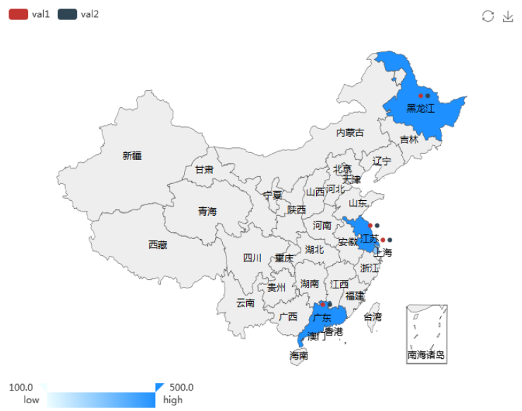
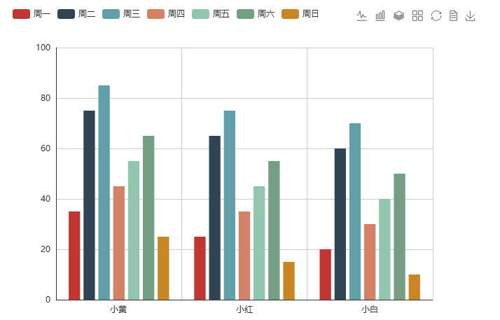
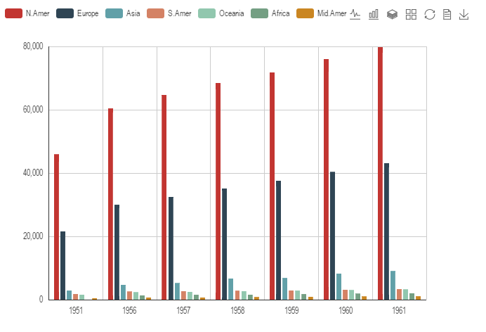
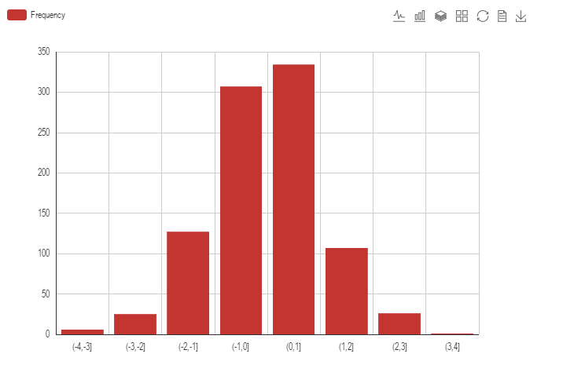
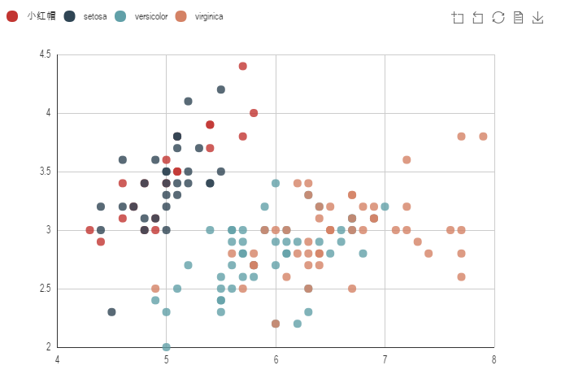

recharts
========
[](https://travis-ci.org/cosname/recharts)

A R interface to [ECharts](https://github.com/ecomfe/echarts) for data visualization.

文档请点击：<https://recharts.cosx.org>

recharts 提供了百度开源可视化js框架ECharts的R语言接口，现提供的图形展示接口包括：地图（eMap），柱状图（eBar），折线图（eLine），
雷达图（eRadar），散点图（ePoints），漏斗图（eFunnel）以及万恶的饼图（ePie）。
同时计划对力导向图（[eForce](http://echarts.baidu.com/demo.html#graph-force)），
时间序列散点图([ePoints_timeSeries](http://echarts.baidu.com/demo.html#graph-life-expectancy))，矩阵树图([eTree](http://echarts.baidu.com/demo.html#treemap-disk))，平行坐标图([eParallel](http://echarts.baidu.com/demo.html#parallel-aqi)) 和桑基图（[eSankey](http://echarts.baidu.com/demo.html#sankey-energy)）图逐一实现。

# 安装 {#Installation}

部分 R 语言版本(R 3.2.2)会出现中文字符乱码，建议使用R语言版本为 `r R.version.string`。

recharts 包的源代码在 [Github](https://github.com/cosname/recharts) 上提供下载与安装，安装需要使用以下代码：

```{r, eval = FALSE}
remotes::install_github("cosname/recharts")
```

# 图形模块

## 地图 {#eMap}

地图分别提供了世界地图、美国、中国地图以及各省级行政区地图，需要使用`region`参数进行地图显示地区的设置。

地图的使用需要由一个data.frame作为输入，包括了一列地名和多列数值，需要使用`~列名`的方式进行数值传递。

```{r}
library(recharts)
mapData <- data.frame(
  province = c("上海", "江苏", "广东", "黑龙江"),
  val1 = c(100, 200, 300, 500), 
  val2 = c(200, 300, 400, 200), 
  val3 = c(1, 2, 3, 5), stringsAsFactors = FALSE
)

## 全国地图
eMap(mapData, namevar = ~province, datavar = ~ val1 + val2)
```



```{r}
provinceMapData <- data.frame(
  city = c("扬州市", "南京市", "苏州市"), value = c(100, 200, 300),
  val2 = c(200, 300, 400), val3 = c(1, 2, 3), stringsAsFactors = FALSE
)
## 省份地图
eMap(provinceMapData, namevar = ~city, datavar = ~ value + val2, region = "江苏")
```


## 柱状图 {#eBar}

柱状图(eBar)，允许3种类型的数据对象输入：

1. data.frame，需要指定`xvar=~weekDay; yvar= ~saleNum; series=~seller`，其中`series`参数可选。

```{r}
df2 <- data.frame(
  saleNum = c(10, 20, 30, 40, 50, 60, 70, 15, 25, 35, 45, 
              55, 65, 75, 25, 35, 45, 55, 65, 75, 85),
  seller = c(rep("小黄", 7), rep("小红", 7), rep("小白", 7)),
  weekDay = c(rep(c("周一", "周二", "周三", "周四", "周五", "周六", "周日"), 3))
)
eBar(dat = df2, xvar = ~weekDay, yvar = ~saleNum, series = ~seller)
```




2. 矩阵对象，以数据集 WorldPhones 为例，可以显示以行为X轴分度，列名为颜色分度，
矩阵数值为Y轴分度的柱状图。

```{r}
class(WorldPhones)
WorldPhones
eBar(WorldPhones)
```



3. table对象或因子(factor)数组

```{r}
library(recharts)
eBar(cut(rnorm(1000), -4:4))
```



## 散点图 {#ePoints}

散点图需要的输入是 data.frame，需要指定 `xvar` 和 `yvar`，`series`为可选的颜色分度参数，

```{r}
# 测试下中文
iris$Species <- as.character(iris$Species)
iris$Species[1:20] <- "小红帽"
ePoints(iris, ~Sepal.Length, ~Sepal.Width, series = ~Species)
```


