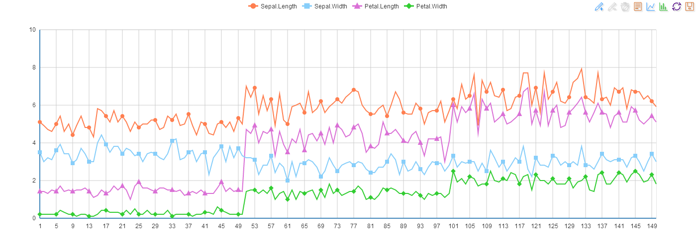
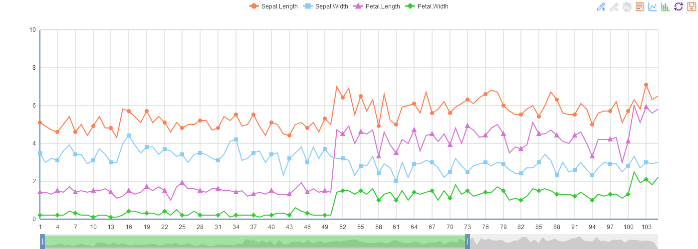
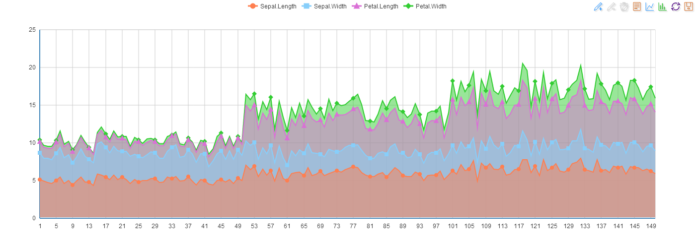
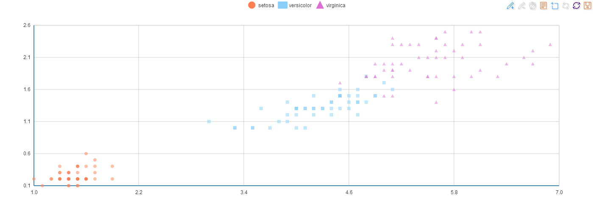
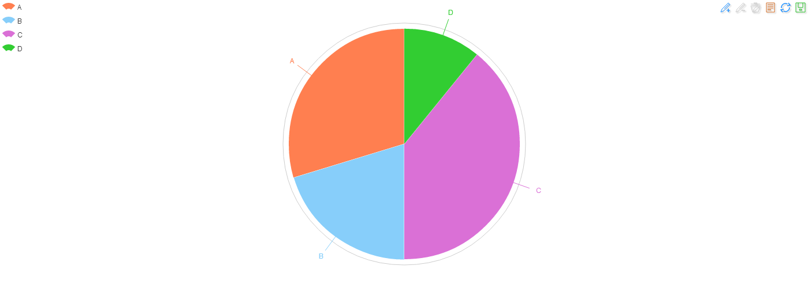
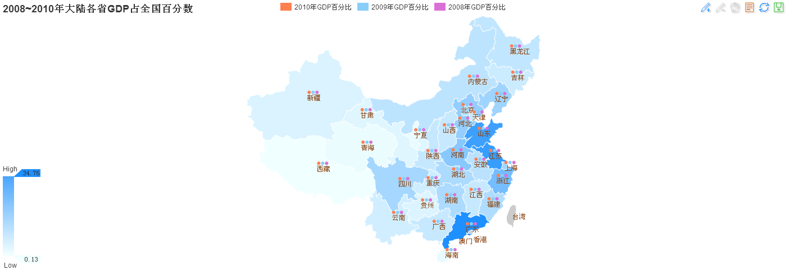

recharts
========

[](https://travis-ci.org/taiyun/recharts)

A R interface to [ECharts](https://github.com/ecomfe/echarts) for data visualization.


## Installation

You can install `recharts` from github using the `devtools` package:

```s
require(devtools)
install_github('recharts', 'taiyun')
```


## Examples


### Demo
```s
require(recharts)
demo(recharts::recharts)
```

```s
demo(recharts::recharts_shiny)
```

```s
demo(recharts::recharts_shiny_pie)
```

### Line Plot

```s
plot(eLine(iris[,1:4]))
plot(eLine(iris[,1:4], opt=list(dataZoom=list(show=TRUE,end=35))))
```





### Area Plot

```s
plot(eArea(iris[,1:4]))
```




### Scatter Plot

```s
plot(ePoints(iris[,3:5]))
```




### Pie Plot

```s
x = sample(4)
names(x) = LETTERS[1:4]
plot(ePie(x))
```




### Bar Plot


```s
plot(eBar(head(iris[,1:4])))
```


### Map

```s
options(encoding="UTF-8")
Sys.setlocale("LC_CTYPE","chs")
load(url('http://yzhou.org/recharts/ChinaGDP.RData'))
plot(eMap(ChinaGDP, opt=list(title=list(text='2008~2010年大陆各省GDP占全国百分数'))))
```


