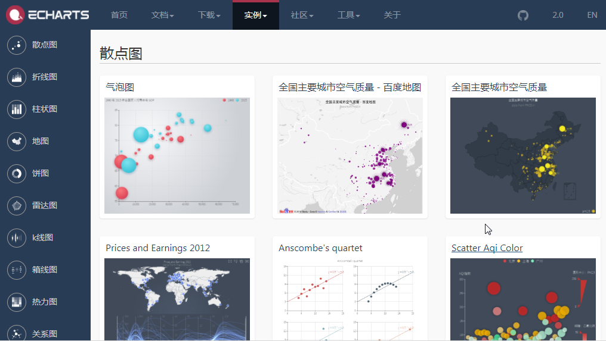

# 案例及接口 {#interface}

## 官网案例(echartsExample)

`echartsExample`提供了一种从官网的[官方实例](http://echarts.baidu.com/examples.html)中获取JS代码并运行的途径, 除去某些需要加载JSON数据文件的例子, echartsExample`支持大部分Echarts的官网案例.

这个函数支持的范围比较广, 包括Echarts的基本绘图, ecstat, bamap等高级功能, 是JS代码的源生接口




参数: 

- `url` 例子的网址, 比如`'http://echarts.baidu.com/demo.html#bubble-gradient'`
- `JScontent` 需要执行的JS代码(方便复制例子里面的代码调试执行), **注意要命名一个`option`对象用于数据加载**
- `height` 绘图区域的高度
- `weight` 绘图区域的宽度, 支持百分比


### 官网案例

从http://echarts.baidu.com/demo.html#effectScatter-bmap 获取代码, 并转换为R绘图.

```{r}
library(recharts)
echartsExample("http://echarts.baidu.com/demo.html#effectScatter-bmap")
```


### JS代码案例 {#jscode}

在R的环境中基于源生JS代码执行echarts绘图.

```{r}
JScodes = "
var option = {
  title: {
    text: 'ECharts entry example'
  },
  tooltip: {},
  legend: {
    data:['Sales']
  },
  xAxis: {
    data: ['shirt','cardign','chiffon shirt','pants','heels','socks']
  },
  yAxis: {},
  series: [{
    name: 'Sales',
    type: 'bar',
    data: [5, 20, 36, 10, 10, 20]
  }]
};
"
echartsExample(JScontent=JScodes)
```


## 从R对象中绘图(ePlot)

R中实现Echarts的形式类似于在R中建立一个List来模拟上例中option对象, 然后通过写好的框架实现Echarts对象的绘制, 其中`ePlot`, 用于根据一个R的list对象来构建Echarts.
其实, 更粗暴的方式是从`htmlwidgets::createWidget('echarts', opt, package = 'recharts')`来构建.

参数: 

- `series` 用于保存echarts中的数据内容, 类似echarts中的`option.series`
- `ext` 用于保存echarts中的其他设置参数, 类似echarts中的`option.xAsix`等
- `size` 绘图区域的宽度与高度

### 构建基本对象

我们可以用这个方法构建之前[JS实现的例子](#jscode)
```{r}
# 定义数据部分
series = list(list(
   name = 'Sales',
   type = 'bar',
   data = c(5, 20, 36, 10, 10, 20)
))
# 定义坐标轴部分
ext = list(
  xAxis = list(list( 
    data = c('shirt','cardign','chiffon shirt','pants','heels','socks')
  )),
  yAxis = list(list())
)
# 绘制
ePlot(series, ext)
```

当然, 这个例子可以更粗暴的用`htmlwidgets::createWidget`实现, 其实你所看到的recharts的例子, 底层都是通过调用这个函数实现的:

```{r eval = F}
opt = list(
  xAxis = list(list( 
    data = c('shirt','cardign','chiffon shirt','pants','heels','socks')
  )),
  
  yAxis = list(list()),
  series = list(list(
   name = 'Sales',
   type = 'bar',
   data = c(5, 20, 36, 10, 10, 20)
))
)
htmlwidgets::createWidget('echarts', opt, package = 'recharts')
```

### 线柱混合
这是一个用ePlot来实现线柱混合的例子, 原始数据设定来源于[Echarts](http://echarts.baidu.com/demo.html#multiple-y-axis)

```{r}
series2 = list(
  list(
    name = '蒸发量',
    type = 'bar',
    data = c(2.0, 4.9, 7.0, 23.2, 25.6, 76.7, 135.6, 162.2, 32.6, 20.0, 6.4, 3.3)
  ),
  list(
    name = '降水量',
    type = 'bar',
    data = c(2.6, 5.9, 9.0, 26.4, 28.7, 70.7, 175.6, 182.2, 48.7, 18.8, 6.0, 2.3)

  ),
  list(
    name = '平均温度',
    type = 'line',
    yAxisIndex = 1,
    data = c(2.0, 2.2, 3.3, 4.5, 6.3, 10.2, 20.3, 23.4, 23.0, 16.5, 12.0, 6.2)

  )
)

ext = list(
  xAxis = list(list(
    type = "category",
    data = c("1月", "2月", "3月", "4月", "5月", "6月",
             "7月", "8月", "9月", "10月", "11月",  "12月")
)),
  yAxis = list(
    list(
      type =  'value',
      name =  '水量',
      min =  0,
      max =  250,
      interval =  50,
      axisLabel =  list(
        formatter =  '{value} ml'
      )
    ),
   list(
      type =  'value',
      name =  '温度',
      min =  0,
      max =  25,
      interval =  5,
      axisLabel = list(
        formatter= '{value}℃'
      )
    )
  ))
ePlot(series2, ext )
```

