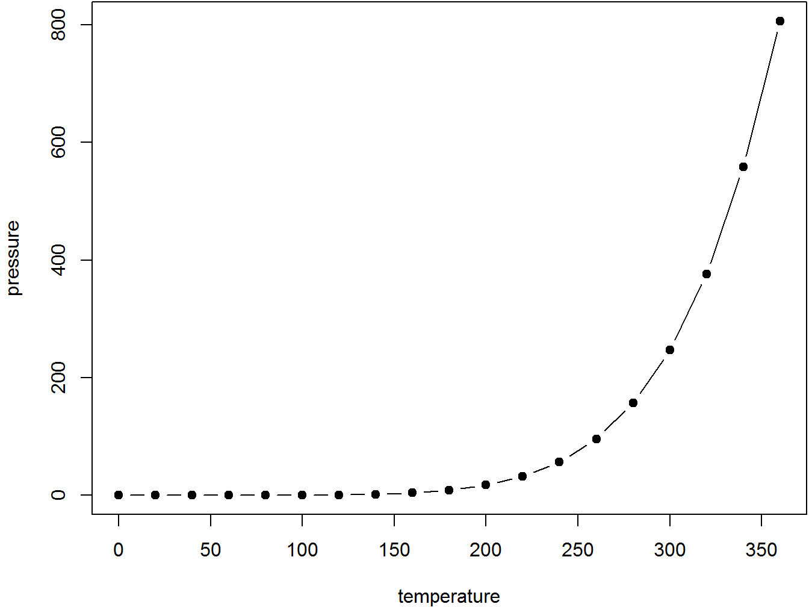

# recharts介绍 {#intro}


recharts
========
[](https://travis-ci.org/taiyun/recharts)

A R interface to [ECharts](https://github.com/ecomfe/echarts) for data visualization.

recharts 提供了百度开源可视化js框架ECharts的R语言接口，现提供的图形展示接口包括：地图（eMap），柱状图（eBar），折线图（eLine），
雷达图（eRadar），散点图（ePoints），漏斗图（eFunnel）以及万恶的饼图（ePie）。
同时计划对力导向图（[eForce](http://echarts.baidu.com/demo.html#graph-force)），
时间序列散点图([ePoints_timeSeries](http://echarts.baidu.com/demo.html#graph-life-expectancy))，
矩阵树图([eTree](http://echarts.baidu.com/demo.html#treemap-disk))，
平行坐标图([eParallel](http://echarts.baidu.com/demo.html#parallel-aqi))
和桑基图（[eSankey](http://echarts.baidu.com/demo.html#sankey-energy)）图逐一实现。

# recharts的安装(Installation)
recharts包的源代码在[Github/taiyun/recharts](https://github.com/taiyun/recharts)上提供下载与安装，安装需要使用以下代码：


```r
require(devtools)
devtools::install_github("taiyun/recharts@dev")
```


目前计划任务列表在[https://github.com/taiyun/recharts/issues/43](https://github.com/taiyun/recharts/issues/43)

欢迎贡献issue以及贡献代码


<!--chapter:end:01-rechartsIntro.Rmd-->

# 案例及接口 {#interface}

## 官网案例(echartsExample)

`echartsExample`提供了一种从官网的[官方实例](http://echarts.baidu.com/examples.html)中获取JS代码并运行的途径, 除去某些需要加载JSON数据文件的例子, echartsExample`支持大部分Echarts的官网案例.

这个函数支持的范围比较广, 包括Echarts的基本绘图, ecstat, bamap等高级功能, 是JS代码的源生接口


参数: 

- `url` 例子的网址, 比如`'http://echarts.baidu.com/demo.html#bubble-gradient'`
- `JScontent` 需要执行的JS代码(方便复制例子里面的代码调试执行), **注意要命名一个`option`对象用于数据加载**
- `height` 绘图区域的高度
- `weight` 绘图区域的宽度, 支持百分比


### 官网案例

从http://echarts.baidu.com/demo.html#effectScatter-bmap 获取代码, 并转换为R绘图.


```r
library(recharts)
echartsExample("http://echarts.baidu.com/demo.html#effectScatter-bmap")
```

<!--html_preserve--><div id="htmlwidget-c1867e851b6d0c359ac2" style="width:672px;height:480px;" class="echarts html-widget"></div>
<script type="application/json" data-for="htmlwidget-c1867e851b6d0c359ac2">{"x":{"title":{"text":"","subtext":"","x":"center","y":"top"},"calculable":true,"theme":"default","tooltip":{"show":true,"trigger":"axis"},"toolbox":{"show":true,"x":"right","y":"top","orient":"horizontal","feature":{"mark":{"show":true},"dataZoom":{"show":false},"magicType":{"show":true,"type":["line","bar","stack","tiled"]},"restore":{"show":true},"dataView":{"show":{"readOnly":false}},"saveAsImage":{"show":true}}},"legend":{"show":true,"orient":"horizontal","x":"left","y":"top","data":["Frequency"]},"xAxis":{"position":"bottom","name":"","nameLocation":"start","scale":true,"precision":2,"power":2,"axisLine":{"show":true},"axisTick":{"show":false},"axisLable":{"show":true,"textStyle":{"color":"black"}},"splitLine":{"show":true},"splitArea":{"show":false},"type":"category","data":["(-4,-3]","(-3,-2]","(-2,-1]","(-1,0]","(0,1]","(1,2]","(2,3]","(3,4]"],"boundaryGap":true},"yAxis":{"position":"left","name":"","nameLocation":"start","scale":true,"precision":2,"power":2,"axisLine":{"show":true},"axisTick":{"show":false},"axisLable":{"show":true},"splitLine":{"show":true},"splitArea":{"show":false},"type":"value","boundaryGap":[0,0]},"series":[{"type":"line","name":"Frequency","data":[0,24,151,348,331,123,21,2]}]},"evals":[],"jsHooks":{"render":[{"code":"function(el,x){var app={};myChart = echarts.getInstanceByDom(el);var data = [\n     {name: '海门', value: 9},\n     {name: '鄂尔多斯', value: 12},\n     {name: '招远', value: 12},\n     {name: '舟山', value: 12},\n     {name: '齐齐哈尔', value: 14},\n     {name: '盐城', value: 15},\n     {name: '赤峰', value: 16},\n     {name: '青岛', value: 18},\n     {name: '乳山', value: 18},\n     {name: '金昌', value: 19},\n     {name: '泉州', value: 21},\n     {name: '莱西', value: 21},\n     {name: '日照', value: 21},\n     {name: '胶南', value: 22},\n     {name: '南通', value: 23},\n     {name: '拉萨', value: 24},\n     {name: '云浮', value: 24},\n     {name: '梅州', value: 25},\n     {name: '文登', value: 25},\n     {name: '上海', value: 25},\n     {name: '攀枝花', value: 25},\n     {name: '威海', value: 25},\n     {name: '承德', value: 25},\n     {name: '厦门', value: 26},\n     {name: '汕尾', value: 26},\n     {name: '潮州', value: 26},\n     {name: '丹东', value: 27},\n     {name: '太仓', value: 27},\n     {name: '曲靖', value: 27},\n     {name: '烟台', value: 28},\n     {name: '福州', value: 29},\n     {name: '瓦房店', value: 30},\n     {name: '即墨', value: 30},\n     {name: '抚顺', value: 31},\n     {name: '玉溪', value: 31},\n     {name: '张家口', value: 31},\n     {name: '阳泉', value: 31},\n     {name: '莱州', value: 32},\n     {name: '湖州', value: 32},\n     {name: '汕头', value: 32},\n     {name: '昆山', value: 33},\n     {name: '宁波', value: 33},\n     {name: '湛江', value: 33},\n     {name: '揭阳', value: 34},\n     {name: '荣成', value: 34},\n     {name: '连云港', value: 35},\n     {name: '葫芦岛', value: 35},\n     {name: '常熟', value: 36},\n     {name: '东莞', value: 36},\n     {name: '河源', value: 36},\n     {name: '淮安', value: 36},\n     {name: '泰州', value: 36},\n     {name: '南宁', value: 37},\n     {name: '营口', value: 37},\n     {name: '惠州', value: 37},\n     {name: '江阴', value: 37},\n     {name: '蓬莱', value: 37},\n     {name: '韶关', value: 38},\n     {name: '嘉峪关', value: 38},\n     {name: '广州', value: 38},\n     {name: '延安', value: 38},\n     {name: '太原', value: 39},\n     {name: '清远', value: 39},\n     {name: '中山', value: 39},\n     {name: '昆明', value: 39},\n     {name: '寿光', value: 40},\n     {name: '盘锦', value: 40},\n     {name: '长治', value: 41},\n     {name: '深圳', value: 41},\n     {name: '珠海', value: 42},\n     {name: '宿迁', value: 43},\n     {name: '咸阳', value: 43},\n     {name: '铜川', value: 44},\n     {name: '平度', value: 44},\n     {name: '佛山', value: 44},\n     {name: '海口', value: 44},\n     {name: '江门', value: 45},\n     {name: '章丘', value: 45},\n     {name: '肇庆', value: 46},\n     {name: '大连', value: 47},\n     {name: '临汾', value: 47},\n     {name: '吴江', value: 47},\n     {name: '石嘴山', value: 49},\n     {name: '沈阳', value: 50},\n     {name: '苏州', value: 50},\n     {name: '茂名', value: 50},\n     {name: '嘉兴', value: 51},\n     {name: '长春', value: 51},\n     {name: '胶州', value: 52},\n     {name: '银川', value: 52},\n     {name: '张家港', value: 52},\n     {name: '三门峡', value: 53},\n     {name: '锦州', value: 54},\n     {name: '南昌', value: 54},\n     {name: '柳州', value: 54},\n     {name: '三亚', value: 54},\n     {name: '自贡', value: 56},\n     {name: '吉林', value: 56},\n     {name: '阳江', value: 57},\n     {name: '泸州', value: 57},\n     {name: '西宁', value: 57},\n     {name: '宜宾', value: 58},\n     {name: '呼和浩特', value: 58},\n     {name: '成都', value: 58},\n     {name: '大同', value: 58},\n     {name: '镇江', value: 59},\n     {name: '桂林', value: 59},\n     {name: '张家界', value: 59},\n     {name: '宜兴', value: 59},\n     {name: '北海', value: 60},\n     {name: '西安', value: 61},\n     {name: '金坛', value: 62},\n     {name: '东营', value: 62},\n     {name: '牡丹江', value: 63},\n     {name: '遵义', value: 63},\n     {name: '绍兴', value: 63},\n     {name: '扬州', value: 64},\n     {name: '常州', value: 64},\n     {name: '潍坊', value: 65},\n     {name: '重庆', value: 66},\n     {name: '台州', value: 67},\n     {name: '南京', value: 67},\n     {name: '滨州', value: 70},\n     {name: '贵阳', value: 71},\n     {name: '无锡', value: 71},\n     {name: '本溪', value: 71},\n     {name: '克拉玛依', value: 72},\n     {name: '渭南', value: 72},\n     {name: '马鞍山', value: 72},\n     {name: '宝鸡', value: 72},\n     {name: '焦作', value: 75},\n     {name: '句容', value: 75},\n     {name: '北京', value: 79},\n     {name: '徐州', value: 79},\n     {name: '衡水', value: 80},\n     {name: '包头', value: 80},\n     {name: '绵阳', value: 80},\n     {name: '乌鲁木齐', value: 84},\n     {name: '枣庄', value: 84},\n     {name: '杭州', value: 84},\n     {name: '淄博', value: 85},\n     {name: '鞍山', value: 86},\n     {name: '溧阳', value: 86},\n     {name: '库尔勒', value: 86},\n     {name: '安阳', value: 90},\n     {name: '开封', value: 90},\n     {name: '济南', value: 92},\n     {name: '德阳', value: 93},\n     {name: '温州', value: 95},\n     {name: '九江', value: 96},\n     {name: '邯郸', value: 98},\n     {name: '临安', value: 99},\n     {name: '兰州', value: 99},\n     {name: '沧州', value: 100},\n     {name: '临沂', value: 103},\n     {name: '南充', value: 104},\n     {name: '天津', value: 105},\n     {name: '富阳', value: 106},\n     {name: '泰安', value: 112},\n     {name: '诸暨', value: 112},\n     {name: '郑州', value: 113},\n     {name: '哈尔滨', value: 114},\n     {name: '聊城', value: 116},\n     {name: '芜湖', value: 117},\n     {name: '唐山', value: 119},\n     {name: '平顶山', value: 119},\n     {name: '邢台', value: 119},\n     {name: '德州', value: 120},\n     {name: '济宁', value: 120},\n     {name: '荆州', value: 127},\n     {name: '宜昌', value: 130},\n     {name: '义乌', value: 132},\n     {name: '丽水', value: 133},\n     {name: '洛阳', value: 134},\n     {name: '秦皇岛', value: 136},\n     {name: '株洲', value: 143},\n     {name: '石家庄', value: 147},\n     {name: '莱芜', value: 148},\n     {name: '常德', value: 152},\n     {name: '保定', value: 153},\n     {name: '湘潭', value: 154},\n     {name: '金华', value: 157},\n     {name: '岳阳', value: 169},\n     {name: '长沙', value: 175},\n     {name: '衢州', value: 177},\n     {name: '廊坊', value: 193},\n     {name: '菏泽', value: 194},\n     {name: '合肥', value: 229},\n     {name: '武汉', value: 273},\n     {name: '大庆', value: 279}\n];\nvar geoCoordMap = {\n    '海门':[121.15,31.89],\n    '鄂尔多斯':[109.781327,39.608266],\n    '招远':[120.38,37.35],\n    '舟山':[122.207216,29.985295],\n    '齐齐哈尔':[123.97,47.33],\n    '盐城':[120.13,33.38],\n    '赤峰':[118.87,42.28],\n    '青岛':[120.33,36.07],\n    '乳山':[121.52,36.89],\n    '金昌':[102.188043,38.520089],\n    '泉州':[118.58,24.93],\n    '莱西':[120.53,36.86],\n    '日照':[119.46,35.42],\n    '胶南':[119.97,35.88],\n    '南通':[121.05,32.08],\n    '拉萨':[91.11,29.97],\n    '云浮':[112.02,22.93],\n    '梅州':[116.1,24.55],\n    '文登':[122.05,37.2],\n    '上海':[121.48,31.22],\n    '攀枝花':[101.718637,26.582347],\n    '威海':[122.1,37.5],\n    '承德':[117.93,40.97],\n    '厦门':[118.1,24.46],\n    '汕尾':[115.375279,22.786211],\n    '潮州':[116.63,23.68],\n    '丹东':[124.37,40.13],\n    '太仓':[121.1,31.45],\n    '曲靖':[103.79,25.51],\n    '烟台':[121.39,37.52],\n    '福州':[119.3,26.08],\n    '瓦房店':[121.979603,39.627114],\n    '即墨':[120.45,36.38],\n    '抚顺':[123.97,41.97],\n    '玉溪':[102.52,24.35],\n    '张家口':[114.87,40.82],\n    '阳泉':[113.57,37.85],\n    '莱州':[119.942327,37.177017],\n    '湖州':[120.1,30.86],\n    '汕头':[116.69,23.39],\n    '昆山':[120.95,31.39],\n    '宁波':[121.56,29.86],\n    '湛江':[110.359377,21.270708],\n    '揭阳':[116.35,23.55],\n    '荣成':[122.41,37.16],\n    '连云港':[119.16,34.59],\n    '葫芦岛':[120.836932,40.711052],\n    '常熟':[120.74,31.64],\n    '东莞':[113.75,23.04],\n    '河源':[114.68,23.73],\n    '淮安':[119.15,33.5],\n    '泰州':[119.9,32.49],\n    '南宁':[108.33,22.84],\n    '营口':[122.18,40.65],\n    '惠州':[114.4,23.09],\n    '江阴':[120.26,31.91],\n    '蓬莱':[120.75,37.8],\n    '韶关':[113.62,24.84],\n    '嘉峪关':[98.289152,39.77313],\n    '广州':[113.23,23.16],\n    '延安':[109.47,36.6],\n    '太原':[112.53,37.87],\n    '清远':[113.01,23.7],\n    '中山':[113.38,22.52],\n    '昆明':[102.73,25.04],\n    '寿光':[118.73,36.86],\n    '盘锦':[122.070714,41.119997],\n    '长治':[113.08,36.18],\n    '深圳':[114.07,22.62],\n    '珠海':[113.52,22.3],\n    '宿迁':[118.3,33.96],\n    '咸阳':[108.72,34.36],\n    '铜川':[109.11,35.09],\n    '平度':[119.97,36.77],\n    '佛山':[113.11,23.05],\n    '海口':[110.35,20.02],\n    '江门':[113.06,22.61],\n    '章丘':[117.53,36.72],\n    '肇庆':[112.44,23.05],\n    '大连':[121.62,38.92],\n    '临汾':[111.5,36.08],\n    '吴江':[120.63,31.16],\n    '石嘴山':[106.39,39.04],\n    '沈阳':[123.38,41.8],\n    '苏州':[120.62,31.32],\n    '茂名':[110.88,21.68],\n    '嘉兴':[120.76,30.77],\n    '长春':[125.35,43.88],\n    '胶州':[120.03336,36.264622],\n    '银川':[106.27,38.47],\n    '张家港':[120.555821,31.875428],\n    '三门峡':[111.19,34.76],\n    '锦州':[121.15,41.13],\n    '南昌':[115.89,28.68],\n    '柳州':[109.4,24.33],\n    '三亚':[109.511909,18.252847],\n    '自贡':[104.778442,29.33903],\n    '吉林':[126.57,43.87],\n    '阳江':[111.95,21.85],\n    '泸州':[105.39,28.91],\n    '西宁':[101.74,36.56],\n    '宜宾':[104.56,29.77],\n    '呼和浩特':[111.65,40.82],\n    '成都':[104.06,30.67],\n    '大同':[113.3,40.12],\n    '镇江':[119.44,32.2],\n    '桂林':[110.28,25.29],\n    '张家界':[110.479191,29.117096],\n    '宜兴':[119.82,31.36],\n    '北海':[109.12,21.49],\n    '西安':[108.95,34.27],\n    '金坛':[119.56,31.74],\n    '东营':[118.49,37.46],\n    '牡丹江':[129.58,44.6],\n    '遵义':[106.9,27.7],\n    '绍兴':[120.58,30.01],\n    '扬州':[119.42,32.39],\n    '常州':[119.95,31.79],\n    '潍坊':[119.1,36.62],\n    '重庆':[106.54,29.59],\n    '台州':[121.420757,28.656386],\n    '南京':[118.78,32.04],\n    '滨州':[118.03,37.36],\n    '贵阳':[106.71,26.57],\n    '无锡':[120.29,31.59],\n    '本溪':[123.73,41.3],\n    '克拉玛依':[84.77,45.59],\n    '渭南':[109.5,34.52],\n    '马鞍山':[118.48,31.56],\n    '宝鸡':[107.15,34.38],\n    '焦作':[113.21,35.24],\n    '句容':[119.16,31.95],\n    '北京':[116.46,39.92],\n    '徐州':[117.2,34.26],\n    '衡水':[115.72,37.72],\n    '包头':[110,40.58],\n    '绵阳':[104.73,31.48],\n    '乌鲁木齐':[87.68,43.77],\n    '枣庄':[117.57,34.86],\n    '杭州':[120.19,30.26],\n    '淄博':[118.05,36.78],\n    '鞍山':[122.85,41.12],\n    '溧阳':[119.48,31.43],\n    '库尔勒':[86.06,41.68],\n    '安阳':[114.35,36.1],\n    '开封':[114.35,34.79],\n    '济南':[117,36.65],\n    '德阳':[104.37,31.13],\n    '温州':[120.65,28.01],\n    '九江':[115.97,29.71],\n    '邯郸':[114.47,36.6],\n    '临安':[119.72,30.23],\n    '兰州':[103.73,36.03],\n    '沧州':[116.83,38.33],\n    '临沂':[118.35,35.05],\n    '南充':[106.110698,30.837793],\n    '天津':[117.2,39.13],\n    '富阳':[119.95,30.07],\n    '泰安':[117.13,36.18],\n    '诸暨':[120.23,29.71],\n    '郑州':[113.65,34.76],\n    '哈尔滨':[126.63,45.75],\n    '聊城':[115.97,36.45],\n    '芜湖':[118.38,31.33],\n    '唐山':[118.02,39.63],\n    '平顶山':[113.29,33.75],\n    '邢台':[114.48,37.05],\n    '德州':[116.29,37.45],\n    '济宁':[116.59,35.38],\n    '荆州':[112.239741,30.335165],\n    '宜昌':[111.3,30.7],\n    '义乌':[120.06,29.32],\n    '丽水':[119.92,28.45],\n    '洛阳':[112.44,34.7],\n    '秦皇岛':[119.57,39.95],\n    '株洲':[113.16,27.83],\n    '石家庄':[114.48,38.03],\n    '莱芜':[117.67,36.19],\n    '常德':[111.69,29.05],\n    '保定':[115.48,38.85],\n    '湘潭':[112.91,27.87],\n    '金华':[119.64,29.12],\n    '岳阳':[113.09,29.37],\n    '长沙':[113,28.21],\n    '衢州':[118.88,28.97],\n    '廊坊':[116.7,39.53],\n    '菏泽':[115.480656,35.23375],\n    '合肥':[117.27,31.86],\n    '武汉':[114.31,30.52],\n    '大庆':[125.03,46.58]\n};\n\nvar convertData = function (data) {\n    var res = [];\n    for (var i = 0; i < data.length; i++) {\n        var geoCoord = geoCoordMap[data[i].name];\n        if (geoCoord) {\n            res.push({\n                name: data[i].name,\n                value: geoCoord.concat(data[i].value)\n            });\n        }\n    }\n    return res;\n};\n\noption = {\n    title: {\n        text: '全国主要城市空气质量 - 百度地图',\n        subtext: 'data from PM25.in',\n        sublink: 'http://www.pm25.in',\n        left: 'center'\n    },\n    tooltip : {\n        trigger: 'item'\n    },\n    bmap: {\n        center: [104.114129, 37.550339],\n        zoom: 5,\n        roam: true,\n        mapStyle: {\n            styleJson: [{\n                'featureType': 'water',\n                'elementType': 'all',\n                'stylers': {\n                    'color': '#d1d1d1'\n                }\n            }, {\n                'featureType': 'land',\n                'elementType': 'all',\n                'stylers': {\n                    'color': '#f3f3f3'\n                }\n            }, {\n                'featureType': 'railway',\n                'elementType': 'all',\n                'stylers': {\n                    'visibility': 'off'\n                }\n            }, {\n                'featureType': 'highway',\n                'elementType': 'all',\n                'stylers': {\n                    'color': '#fdfdfd'\n                }\n            }, {\n                'featureType': 'highway',\n                'elementType': 'labels',\n                'stylers': {\n                    'visibility': 'off'\n                }\n            }, {\n                'featureType': 'arterial',\n                'elementType': 'geometry',\n                'stylers': {\n                    'color': '#fefefe'\n                }\n            }, {\n                'featureType': 'arterial',\n                'elementType': 'geometry.fill',\n                'stylers': {\n                    'color': '#fefefe'\n                }\n            }, {\n                'featureType': 'poi',\n                'elementType': 'all',\n                'stylers': {\n                    'visibility': 'off'\n                }\n            }, {\n                'featureType': 'green',\n                'elementType': 'all',\n                'stylers': {\n                    'visibility': 'off'\n                }\n            }, {\n                'featureType': 'subway',\n                'elementType': 'all',\n                'stylers': {\n                    'visibility': 'off'\n                }\n            }, {\n                'featureType': 'manmade',\n                'elementType': 'all',\n                'stylers': {\n                    'color': '#d1d1d1'\n                }\n            }, {\n                'featureType': 'local',\n                'elementType': 'all',\n                'stylers': {\n                    'color': '#d1d1d1'\n                }\n            }, {\n                'featureType': 'arterial',\n                'elementType': 'labels',\n                'stylers': {\n                    'visibility': 'off'\n                }\n            }, {\n                'featureType': 'boundary',\n                'elementType': 'all',\n                'stylers': {\n                    'color': '#fefefe'\n                }\n            }, {\n                'featureType': 'building',\n                'elementType': 'all',\n                'stylers': {\n                    'color': '#d1d1d1'\n                }\n            }, {\n                'featureType': 'label',\n                'elementType': 'labels.text.fill',\n                'stylers': {\n                    'color': '#999999'\n                }\n            }]\n        }\n    },\n    series : [\n        {\n            name: 'pm2.5',\n            type: 'scatter',\n            coordinateSystem: 'bmap',\n            data: convertData(data),\n            symbolSize: function (val) {\n                return val[2] / 10;\n            },\n            label: {\n                normal: {\n                    formatter: '{b}',\n                    position: 'right',\n                    show: false\n                },\n                emphasis: {\n                    show: true\n                }\n            },\n            itemStyle: {\n                normal: {\n                    color: 'purple'\n                }\n            }\n        },\n        {\n            name: 'Top 5',\n            type: 'effectScatter',\n            coordinateSystem: 'bmap',\n            data: convertData(data.sort(function (a, b) {\n                return b.value - a.value;\n            }).slice(0, 6)),\n            symbolSize: function (val) {\n                return val[2] / 10;\n            },\n            showEffectOn: 'render',\n            rippleEffect: {\n                brushType: 'stroke'\n            },\n            hoverAnimation: true,\n            label: {\n                normal: {\n                    formatter: '{b}',\n                    position: 'right',\n                    show: true\n                }\n            },\n            itemStyle: {\n                normal: {\n                    color: 'purple',\n                    shadowBlur: 10,\n                    shadowColor: '#333'\n                }\n            },\n            zlevel: 1\n        }\n    ]\n};myChart.setOption(option,true);}","data":null}]}}</script><!--/html_preserve-->


### JS代码案例 {#jscode}

在R的环境中基于源生JS代码执行echarts绘图.


```r
JScodes = "
var option = {
  title: {
    text: 'ECharts entry example'
  },
  tooltip: {},
  legend: {
    data:['Sales']
  },
  xAxis: {
    data: ['shirt','cardign','chiffon shirt','pants','heels','socks']
  },
  yAxis: {},
  series: [{
    name: 'Sales',
    type: 'bar',
    data: [5, 20, 36, 10, 10, 20]
  }]
};
"
echartsExample(JScontent=JScodes)
```

<!--html_preserve--><div id="htmlwidget-6e2c4093f69e708482e2" style="width:672px;height:480px;" class="echarts html-widget"></div>
<script type="application/json" data-for="htmlwidget-6e2c4093f69e708482e2">{"x":{"title":{"text":"","subtext":"","x":"center","y":"top"},"calculable":true,"theme":"default","tooltip":{"show":true,"trigger":"axis"},"toolbox":{"show":true,"x":"right","y":"top","orient":"horizontal","feature":{"mark":{"show":true},"dataZoom":{"show":false},"magicType":{"show":true,"type":["line","bar","stack","tiled"]},"restore":{"show":true},"dataView":{"show":{"readOnly":false}},"saveAsImage":{"show":true}}},"legend":{"show":true,"orient":"horizontal","x":"left","y":"top","data":["Frequency"]},"xAxis":{"position":"bottom","name":"","nameLocation":"start","scale":true,"precision":2,"power":2,"axisLine":{"show":true},"axisTick":{"show":false},"axisLable":{"show":true,"textStyle":{"color":"black"}},"splitLine":{"show":true},"splitArea":{"show":false},"type":"category","data":["(-4,-3]","(-3,-2]","(-2,-1]","(-1,0]","(0,1]","(1,2]","(2,3]","(3,4]"],"boundaryGap":true},"yAxis":{"position":"left","name":"","nameLocation":"start","scale":true,"precision":2,"power":2,"axisLine":{"show":true},"axisTick":{"show":false},"axisLable":{"show":true},"splitLine":{"show":true},"splitArea":{"show":false},"type":"value","boundaryGap":[0,0]},"series":[{"type":"line","name":"Frequency","data":[0,23,123,326,363,142,20,3]}]},"evals":[],"jsHooks":{"render":[{"code":"function(el,x){var app={};myChart = echarts.getInstanceByDom(el);\nvar option = {\n  title: {\n    text: 'ECharts entry example'\n  },\n  tooltip: {},\n  legend: {\n    data:['Sales']\n  },\n  xAxis: {\n    data: ['shirt','cardign','chiffon shirt','pants','heels','socks']\n  },\n  yAxis: {},\n  series: [{\n    name: 'Sales',\n    type: 'bar',\n    data: [5, 20, 36, 10, 10, 20]\n  }]\n};\nmyChart.setOption(option,true);}","data":null}]}}</script><!--/html_preserve-->


## 从R对象中绘图(ePlot)

R中实现Echarts的形式类似于在R中建立一个List来模拟上例中option对象, 然后通过写好的框架实现Echarts对象的绘制, 其中`ePlot`, 用于根据一个R的list对象来构建Echarts.
其实, 更粗暴的方式是从`htmlwidgets::createWidget('echarts', opt, package = 'recharts')`来构建.

参数: 

- `series` 用于保存echarts中的数据内容, 类似echarts中的`option.series`
- `ext` 用于保存echarts中的其他设置参数, 类似echarts中的`option.xAsix`等
- `size` 绘图区域的宽度与高度

### 构建基本对象

我们可以用这个方法构建之前[JS实现的例子](#jscode)

```r
# 定义数据部分
series = list(list(
   name = 'Sales',
   type = 'bar',
   data = c(5, 20, 36, 10, 10, 20)
))
# 定义坐标轴部分
ext = list(
  xAxis = list(list( 
    data = c('shirt','cardign','chiffon shirt','pants','heels','socks')
  )),
  yAxis = list(list())
)
# 绘制
ePlot(series, ext)
```

<!--html_preserve--><div id="htmlwidget-974f50531754a3d2c301" style="width:672px;height:480px;" class="echarts html-widget"></div>
<script type="application/json" data-for="htmlwidget-974f50531754a3d2c301">{"x":{"legend":{"show":true,"orient":"horizontal","x":"left","y":"top","data":["Sales"]},"title":{"text":"","subtext":"","x":"center","y":"top"},"calculable":true,"theme":"default","tooltip":{"show":true,"trigger":"item","formatter":"{a} <br/>{b} : {c}"},"series":[{"name":"Sales","type":"bar","data":[5,20,36,10,10,20]}],"xAxis":[{"data":["shirt","cardign","chiffon shirt","pants","heels","socks"]}],"yAxis":[[]]},"evals":[],"jsHooks":[]}</script><!--/html_preserve-->

当然, 这个例子可以更粗暴的用`htmlwidgets::createWidget`实现, 其实你所看到的recharts的例子, 底层都是通过调用这个函数实现的:


```r
opt = list(
  xAxis = list(list( 
    data = c('shirt','cardign','chiffon shirt','pants','heels','socks')
  )),
  
  yAxis = list(list()),
  series = list(list(
   name = 'Sales',
   type = 'bar',
   data = c(5, 20, 36, 10, 10, 20)
))
)
htmlwidgets::createWidget('echarts', opt, package = 'recharts')
```

### 线柱混合
这是一个用ePlot来实现线柱混合的例子, 原始数据设定来源于[Echarts](http://echarts.baidu.com/demo.html#multiple-y-axis)


```r
series2 = list(
  list(
    name = '蒸发量',
    type = 'bar',
    data = c(2.0, 4.9, 7.0, 23.2, 25.6, 76.7, 135.6, 162.2, 32.6, 20.0, 6.4, 3.3)
  ),
  list(
    name = '降水量',
    type = 'bar',
    data = c(2.6, 5.9, 9.0, 26.4, 28.7, 70.7, 175.6, 182.2, 48.7, 18.8, 6.0, 2.3)

  ),
  list(
    name = '平均温度',
    type = 'line',
    yAxisIndex = 1,
    data = c(2.0, 2.2, 3.3, 4.5, 6.3, 10.2, 20.3, 23.4, 23.0, 16.5, 12.0, 6.2)

  )
)

ext = list(
  xAxis = list(list(
    type = "category",
    data = c("1月", "2月", "3月", "4月", "5月", "6月",
             "7月", "8月", "9月", "10月", "11月",  "12月")
)),
  yAxis = list(
    list(
      type =  'value',
      name =  '水量',
      min =  0,
      max =  250,
      interval =  50,
      axisLabel =  list(
        formatter =  '{value} ml'
      )
    ),
   list(
      type =  'value',
      name =  '温度',
      min =  0,
      max =  25,
      interval =  5,
      axisLabel = list(
        formatter= '{value}℃'
      )
    )
  ))
ePlot(series2, ext )
```

<!--html_preserve--><div id="htmlwidget-0bccbe58392b22f61d77" style="width:672px;height:480px;" class="echarts html-widget"></div>
<script type="application/json" data-for="htmlwidget-0bccbe58392b22f61d77">{"x":{"legend":{"show":true,"orient":"horizontal","x":"left","y":"top","data":["蒸发量","降水量","平均温度"]},"title":{"text":"","subtext":"","x":"center","y":"top"},"calculable":true,"theme":"default","tooltip":{"show":true,"trigger":"item","formatter":"{a} <br/>{b} : {c}"},"series":[{"name":"蒸发量","type":"bar","data":[2,4.9,7,23.2,25.6,76.7,135.6,162.2,32.6,20,6.4,3.3]},{"name":"降水量","type":"bar","data":[2.6,5.9,9,26.4,28.7,70.7,175.6,182.2,48.7,18.8,6,2.3]},{"name":"平均温度","type":"line","yAxisIndex":1,"data":[2,2.2,3.3,4.5,6.3,10.2,20.3,23.4,23,16.5,12,6.2]}],"xAxis":[{"type":"category","data":["1月","2月","3月","4月","5月","6月","7月","8月","9月","10月","11月","12月"]}],"yAxis":[{"type":"value","name":"水量","min":0,"max":250,"interval":50,"axisLabel":{"formatter":"{value} ml"}},{"type":"value","name":"温度","min":0,"max":25,"interval":5,"axisLabel":{"formatter":"{value}℃"}}]},"evals":[],"jsHooks":[]}</script><!--/html_preserve-->


<!--chapter:end:02-example.Rmd-->

# 基本绘图函数 {#baseFunction}

## 散点图

散点图需要的输入是data.frame，需要指定`xvar`和`yvar`， `series`为可选的颜色分度参数，


```r
ePoints(iris[, 3:5], theme = 2)
```

<!--html_preserve--><div id="htmlwidget-8b90e5f7e371498365e2" style="width:672px;height:480px;" class="echarts html-widget"></div>
<script type="application/json" data-for="htmlwidget-8b90e5f7e371498365e2">{"x":{"title":{"text":"","subtext":"","x":"center","y":"top"},"calculable":false,"theme":"infographic","tooltip":{"show":true,"trigger":"item"},"toolbox":{"show":true,"x":"right","y":"top","orient":"horizontal","feature":{"mark":{"show":true},"dataZoom":{"show":true},"magicType":[],"restore":{"show":true},"dataView":{"show":{"readOnly":false}},"saveAsImage":{"show":true}}},"legend":{"show":true,"orient":"horizontal","x":"left","y":"top","data":["default"]},"xAxis":{"position":"bottom","name":"","nameLocation":"start","scale":true,"precision":2,"power":2,"axisLine":{"show":true},"axisTick":{"show":false},"axisLable":{"show":true,"textStyle":{"color":"black"}},"splitLine":{"show":true},"splitArea":{"show":false},"type":"value","boundaryGap":[0,0]},"yAxis":{"position":"left","name":"","nameLocation":"start","scale":true,"precision":2,"power":2,"axisLine":{"show":true},"axisTick":{"show":false},"axisLable":{"show":true},"splitLine":{"show":true},"splitArea":{"show":false},"type":"value","boundaryGap":[0,0]},"series":[{"type":"scatter","name":"default","data":[[1.4,0.2],[1.4,0.2],[1.3,0.2],[1.5,0.2],[1.4,0.2],[1.7,0.4],[1.4,0.3],[1.5,0.2],[1.4,0.2],[1.5,0.1],[1.5,0.2],[1.6,0.2],[1.4,0.1],[1.1,0.1],[1.2,0.2],[1.5,0.4],[1.3,0.4],[1.4,0.3],[1.7,0.3],[1.5,0.3],[1.7,0.2],[1.5,0.4],[1,0.2],[1.7,0.5],[1.9,0.2],[1.6,0.2],[1.6,0.4],[1.5,0.2],[1.4,0.2],[1.6,0.2],[1.6,0.2],[1.5,0.4],[1.5,0.1],[1.4,0.2],[1.5,0.2],[1.2,0.2],[1.3,0.2],[1.4,0.1],[1.3,0.2],[1.5,0.2],[1.3,0.3],[1.3,0.3],[1.3,0.2],[1.6,0.6],[1.9,0.4],[1.4,0.3],[1.6,0.2],[1.4,0.2],[1.5,0.2],[1.4,0.2],[4.7,1.4],[4.5,1.5],[4.9,1.5],[4,1.3],[4.6,1.5],[4.5,1.3],[4.7,1.6],[3.3,1],[4.6,1.3],[3.9,1.4],[3.5,1],[4.2,1.5],[4,1],[4.7,1.4],[3.6,1.3],[4.4,1.4],[4.5,1.5],[4.1,1],[4.5,1.5],[3.9,1.1],[4.8,1.8],[4,1.3],[4.9,1.5],[4.7,1.2],[4.3,1.3],[4.4,1.4],[4.8,1.4],[5,1.7],[4.5,1.5],[3.5,1],[3.8,1.1],[3.7,1],[3.9,1.2],[5.1,1.6],[4.5,1.5],[4.5,1.6],[4.7,1.5],[4.4,1.3],[4.1,1.3],[4,1.3],[4.4,1.2],[4.6,1.4],[4,1.2],[3.3,1],[4.2,1.3],[4.2,1.2],[4.2,1.3],[4.3,1.3],[3,1.1],[4.1,1.3],[6,2.5],[5.1,1.9],[5.9,2.1],[5.6,1.8],[5.8,2.2],[6.6,2.1],[4.5,1.7],[6.3,1.8],[5.8,1.8],[6.1,2.5],[5.1,2],[5.3,1.9],[5.5,2.1],[5,2],[5.1,2.4],[5.3,2.3],[5.5,1.8],[6.7,2.2],[6.9,2.3],[5,1.5],[5.7,2.3],[4.9,2],[6.7,2],[4.9,1.8],[5.7,2.1],[6,1.8],[4.8,1.8],[4.9,1.8],[5.6,2.1],[5.8,1.6],[6.1,1.9],[6.4,2],[5.6,2.2],[5.1,1.5],[5.6,1.4],[6.1,2.3],[5.6,2.4],[5.5,1.8],[4.8,1.8],[5.4,2.1],[5.6,2.4],[5.1,2.3],[5.1,1.9],[5.9,2.3],[5.7,2.5],[5.2,2.3],[5,1.9],[5.2,2],[5.4,2.3],[5.1,1.8]]}]},"evals":[],"jsHooks":[]}</script><!--/html_preserve-->

```r
iris$Species <- as.character(iris$Species)
iris[1:20, "Species"] = "redFlower"
ePoints(iris[,3:5], xvar = ~Petal.Length, yvar = ~Petal.Width, series = ~Species, theme = 1)
```

<!--html_preserve--><div id="htmlwidget-b6fd6971b8c2b6e49db4" style="width:672px;height:480px;" class="echarts html-widget"></div>
<script type="application/json" data-for="htmlwidget-b6fd6971b8c2b6e49db4">{"x":{"title":{"text":"","subtext":"","x":"center","y":"top"},"calculable":false,"theme":"dark","tooltip":{"show":true,"trigger":"item"},"toolbox":{"show":true,"x":"right","y":"top","orient":"horizontal","feature":{"mark":{"show":true},"dataZoom":{"show":true},"magicType":[],"restore":{"show":true},"dataView":{"show":{"readOnly":false}},"saveAsImage":{"show":true}}},"legend":{"show":true,"orient":"horizontal","x":"left","y":"top","data":["redFlower","setosa","versicolor","virginica"]},"xAxis":{"position":"bottom","name":"","nameLocation":"start","scale":true,"precision":2,"power":2,"axisLine":{"show":true},"axisTick":{"show":false},"axisLable":{"show":true,"textStyle":{"color":"black"}},"splitLine":{"show":true},"splitArea":{"show":false},"type":"value","boundaryGap":[0,0]},"yAxis":{"position":"left","name":"","nameLocation":"start","scale":true,"precision":2,"power":2,"axisLine":{"show":true},"axisTick":{"show":false},"axisLable":{"show":true},"splitLine":{"show":true},"splitArea":{"show":false},"type":"value","boundaryGap":[0,0]},"series":[{"type":"scatter","name":"redFlower","data":[[1.4,0.2],[1.4,0.2],[1.3,0.2],[1.5,0.2],[1.4,0.2],[1.7,0.4],[1.4,0.3],[1.5,0.2],[1.4,0.2],[1.5,0.1],[1.5,0.2],[1.6,0.2],[1.4,0.1],[1.1,0.1],[1.2,0.2],[1.5,0.4],[1.3,0.4],[1.4,0.3],[1.7,0.3],[1.5,0.3]]},{"type":"scatter","name":"setosa","data":[[1.7,0.2],[1.5,0.4],[1,0.2],[1.7,0.5],[1.9,0.2],[1.6,0.2],[1.6,0.4],[1.5,0.2],[1.4,0.2],[1.6,0.2],[1.6,0.2],[1.5,0.4],[1.5,0.1],[1.4,0.2],[1.5,0.2],[1.2,0.2],[1.3,0.2],[1.4,0.1],[1.3,0.2],[1.5,0.2],[1.3,0.3],[1.3,0.3],[1.3,0.2],[1.6,0.6],[1.9,0.4],[1.4,0.3],[1.6,0.2],[1.4,0.2],[1.5,0.2],[1.4,0.2]]},{"type":"scatter","name":"versicolor","data":[[4.7,1.4],[4.5,1.5],[4.9,1.5],[4,1.3],[4.6,1.5],[4.5,1.3],[4.7,1.6],[3.3,1],[4.6,1.3],[3.9,1.4],[3.5,1],[4.2,1.5],[4,1],[4.7,1.4],[3.6,1.3],[4.4,1.4],[4.5,1.5],[4.1,1],[4.5,1.5],[3.9,1.1],[4.8,1.8],[4,1.3],[4.9,1.5],[4.7,1.2],[4.3,1.3],[4.4,1.4],[4.8,1.4],[5,1.7],[4.5,1.5],[3.5,1],[3.8,1.1],[3.7,1],[3.9,1.2],[5.1,1.6],[4.5,1.5],[4.5,1.6],[4.7,1.5],[4.4,1.3],[4.1,1.3],[4,1.3],[4.4,1.2],[4.6,1.4],[4,1.2],[3.3,1],[4.2,1.3],[4.2,1.2],[4.2,1.3],[4.3,1.3],[3,1.1],[4.1,1.3]]},{"type":"scatter","name":"virginica","data":[[6,2.5],[5.1,1.9],[5.9,2.1],[5.6,1.8],[5.8,2.2],[6.6,2.1],[4.5,1.7],[6.3,1.8],[5.8,1.8],[6.1,2.5],[5.1,2],[5.3,1.9],[5.5,2.1],[5,2],[5.1,2.4],[5.3,2.3],[5.5,1.8],[6.7,2.2],[6.9,2.3],[5,1.5],[5.7,2.3],[4.9,2],[6.7,2],[4.9,1.8],[5.7,2.1],[6,1.8],[4.8,1.8],[4.9,1.8],[5.6,2.1],[5.8,1.6],[6.1,1.9],[6.4,2],[5.6,2.2],[5.1,1.5],[5.6,1.4],[6.1,2.3],[5.6,2.4],[5.5,1.8],[4.8,1.8],[5.4,2.1],[5.6,2.4],[5.1,2.3],[5.1,1.9],[5.9,2.3],[5.7,2.5],[5.2,2.3],[5,1.9],[5.2,2],[5.4,2.3],[5.1,1.8]]}]},"evals":[],"jsHooks":[]}</script><!--/html_preserve-->

```r
ePoints(iris[,3:5], xvar = ~Petal.Length, yvar = ~Petal.Width, series = ~Species, theme = 6)
```

<!--html_preserve--><div id="htmlwidget-d95502ae18e0e4ca10cb" style="width:672px;height:480px;" class="echarts html-widget"></div>
<script type="application/json" data-for="htmlwidget-d95502ae18e0e4ca10cb">{"x":{"title":{"text":"","subtext":"","x":"center","y":"top"},"calculable":false,"theme":"vintage","tooltip":{"show":true,"trigger":"item"},"toolbox":{"show":true,"x":"right","y":"top","orient":"horizontal","feature":{"mark":{"show":true},"dataZoom":{"show":true},"magicType":[],"restore":{"show":true},"dataView":{"show":{"readOnly":false}},"saveAsImage":{"show":true}}},"legend":{"show":true,"orient":"horizontal","x":"left","y":"top","data":["redFlower","setosa","versicolor","virginica"]},"xAxis":{"position":"bottom","name":"","nameLocation":"start","scale":true,"precision":2,"power":2,"axisLine":{"show":true},"axisTick":{"show":false},"axisLable":{"show":true,"textStyle":{"color":"black"}},"splitLine":{"show":true},"splitArea":{"show":false},"type":"value","boundaryGap":[0,0]},"yAxis":{"position":"left","name":"","nameLocation":"start","scale":true,"precision":2,"power":2,"axisLine":{"show":true},"axisTick":{"show":false},"axisLable":{"show":true},"splitLine":{"show":true},"splitArea":{"show":false},"type":"value","boundaryGap":[0,0]},"series":[{"type":"scatter","name":"redFlower","data":[[1.4,0.2],[1.4,0.2],[1.3,0.2],[1.5,0.2],[1.4,0.2],[1.7,0.4],[1.4,0.3],[1.5,0.2],[1.4,0.2],[1.5,0.1],[1.5,0.2],[1.6,0.2],[1.4,0.1],[1.1,0.1],[1.2,0.2],[1.5,0.4],[1.3,0.4],[1.4,0.3],[1.7,0.3],[1.5,0.3]]},{"type":"scatter","name":"setosa","data":[[1.7,0.2],[1.5,0.4],[1,0.2],[1.7,0.5],[1.9,0.2],[1.6,0.2],[1.6,0.4],[1.5,0.2],[1.4,0.2],[1.6,0.2],[1.6,0.2],[1.5,0.4],[1.5,0.1],[1.4,0.2],[1.5,0.2],[1.2,0.2],[1.3,0.2],[1.4,0.1],[1.3,0.2],[1.5,0.2],[1.3,0.3],[1.3,0.3],[1.3,0.2],[1.6,0.6],[1.9,0.4],[1.4,0.3],[1.6,0.2],[1.4,0.2],[1.5,0.2],[1.4,0.2]]},{"type":"scatter","name":"versicolor","data":[[4.7,1.4],[4.5,1.5],[4.9,1.5],[4,1.3],[4.6,1.5],[4.5,1.3],[4.7,1.6],[3.3,1],[4.6,1.3],[3.9,1.4],[3.5,1],[4.2,1.5],[4,1],[4.7,1.4],[3.6,1.3],[4.4,1.4],[4.5,1.5],[4.1,1],[4.5,1.5],[3.9,1.1],[4.8,1.8],[4,1.3],[4.9,1.5],[4.7,1.2],[4.3,1.3],[4.4,1.4],[4.8,1.4],[5,1.7],[4.5,1.5],[3.5,1],[3.8,1.1],[3.7,1],[3.9,1.2],[5.1,1.6],[4.5,1.5],[4.5,1.6],[4.7,1.5],[4.4,1.3],[4.1,1.3],[4,1.3],[4.4,1.2],[4.6,1.4],[4,1.2],[3.3,1],[4.2,1.3],[4.2,1.2],[4.2,1.3],[4.3,1.3],[3,1.1],[4.1,1.3]]},{"type":"scatter","name":"virginica","data":[[6,2.5],[5.1,1.9],[5.9,2.1],[5.6,1.8],[5.8,2.2],[6.6,2.1],[4.5,1.7],[6.3,1.8],[5.8,1.8],[6.1,2.5],[5.1,2],[5.3,1.9],[5.5,2.1],[5,2],[5.1,2.4],[5.3,2.3],[5.5,1.8],[6.7,2.2],[6.9,2.3],[5,1.5],[5.7,2.3],[4.9,2],[6.7,2],[4.9,1.8],[5.7,2.1],[6,1.8],[4.8,1.8],[4.9,1.8],[5.6,2.1],[5.8,1.6],[6.1,1.9],[6.4,2],[5.6,2.2],[5.1,1.5],[5.6,1.4],[6.1,2.3],[5.6,2.4],[5.5,1.8],[4.8,1.8],[5.4,2.1],[5.6,2.4],[5.1,2.3],[5.1,1.9],[5.9,2.3],[5.7,2.5],[5.2,2.3],[5,1.9],[5.2,2],[5.4,2.3],[5.1,1.8]]}]},"evals":[],"jsHooks":[]}</script><!--/html_preserve-->


## 线图


```r
head(WorldPhones)
eLine(WorldPhones, theme=1)
```

```
##      N.Amer Europe Asia S.Amer Oceania Africa Mid.Amer
## 1951  45939  21574 2876   1815    1646     89      555
## 1956  60423  29990 4708   2568    2366   1411      733
## 1957  64721  32510 5230   2695    2526   1546      773
## 1958  68484  35218 6662   2845    2691   1663      836
## 1959  71799  37598 6856   3000    2868   1769      911
## 1960  76036  40341 8220   3145    3054   1905     1008
```

<!--html_preserve--><div id="htmlwidget-a1f49517cabbde2ac523" style="width:672px;height:480px;" class="echarts html-widget"></div>
<script type="application/json" data-for="htmlwidget-a1f49517cabbde2ac523">{"x":{"title":{"text":"","subtext":"","x":"center","y":"top"},"calculable":true,"theme":"dark","tooltip":{"show":true,"trigger":"axis"},"toolbox":{"show":true,"x":"right","y":"top","orient":"horizontal","feature":{"mark":{"show":true},"dataZoom":{"show":false},"magicType":{"show":true,"type":["line","bar","stack","tiled"]},"restore":{"show":true},"dataView":{"show":{"readOnly":false}},"saveAsImage":{"show":true}}},"legend":{"show":true,"orient":"horizontal","x":"left","y":"top","data":["N.Amer","Europe","Asia","S.Amer","Oceania","Africa","Mid.Amer"]},"xAxis":{"position":"bottom","name":"","nameLocation":"start","scale":true,"precision":2,"power":2,"axisLine":{"show":true},"axisTick":{"show":false},"axisLable":{"show":true,"textStyle":{"color":"black"}},"splitLine":{"show":true},"splitArea":{"show":false},"type":"category","data":["1951","1956","1957","1958","1959","1960","1961"],"boundaryGap":true},"yAxis":{"position":"left","name":"","nameLocation":"start","scale":true,"precision":2,"power":2,"axisLine":{"show":true},"axisTick":{"show":false},"axisLable":{"show":true},"splitLine":{"show":true},"splitArea":{"show":false},"type":"value","boundaryGap":[0,0]},"series":[{"type":"line","name":"N.Amer","data":[45939,60423,64721,68484,71799,76036,79831]},{"type":"line","name":"Europe","data":[21574,29990,32510,35218,37598,40341,43173]},{"type":"line","name":"Asia","data":[2876,4708,5230,6662,6856,8220,9053]},{"type":"line","name":"S.Amer","data":[1815,2568,2695,2845,3000,3145,3338]},{"type":"line","name":"Oceania","data":[1646,2366,2526,2691,2868,3054,3224]},{"type":"line","name":"Africa","data":[89,1411,1546,1663,1769,1905,2005]},{"type":"line","name":"Mid.Amer","data":[555,733,773,836,911,1008,1076]}]},"evals":[],"jsHooks":[]}</script><!--/html_preserve-->

```r
#mode 2 input.
df2 <- data.frame(
  saleNum=c(10,20,30,40,50,60,70,15,25,35,45,55,65,75,25,35,45,55,65,75,85),
  seller=c(rep("Yellow",7), rep("Red",7), rep("White",7)),
	 weekDay = c(rep(c("Mon","Tue","Wed","Thu","Fri","Sat","Sun"),3)),
  stringsAsFactors =FALSE
)
eLine(df2, xvar=~weekDay, yvar= ~saleNum, series=~seller)
```

<!--html_preserve--><div id="htmlwidget-77f3a5e8a33e252d4004" style="width:672px;height:480px;" class="echarts html-widget"></div>
<script type="application/json" data-for="htmlwidget-77f3a5e8a33e252d4004">{"x":{"title":{"text":"","subtext":"","x":"center","y":"top"},"calculable":true,"theme":"default","tooltip":{"show":true,"trigger":"axis"},"toolbox":{"show":true,"x":"right","y":"top","orient":"horizontal","feature":{"mark":{"show":true},"dataZoom":{"show":false},"magicType":{"show":true,"type":["line","bar","stack","tiled"]},"restore":{"show":true},"dataView":{"show":{"readOnly":false}},"saveAsImage":{"show":true}}},"legend":{"show":true,"orient":"horizontal","x":"left","y":"top","data":["Yellow","Red","White"]},"xAxis":{"position":"bottom","name":"","nameLocation":"start","scale":true,"precision":2,"power":2,"axisLine":{"show":true},"axisTick":{"show":false},"axisLable":{"show":true,"textStyle":{"color":"black"}},"splitLine":{"show":true},"splitArea":{"show":false},"type":"category","data":["Mon","Tue","Wed","Thu","Fri","Sat","Sun"],"boundaryGap":true},"yAxis":{"position":"left","name":"","nameLocation":"start","scale":true,"precision":2,"power":2,"axisLine":{"show":true},"axisTick":{"show":false},"axisLable":{"show":true},"splitLine":{"show":true},"splitArea":{"show":false},"type":"value","boundaryGap":[0,0]},"series":[{"type":"line","name":"Yellow","data":[10,20,30,40,50,60,70]},{"type":"line","name":"Red","data":[15,25,35,45,55,65,75]},{"type":"line","name":"White","data":[25,35,45,55,65,75,85]}]},"evals":[],"jsHooks":[]}</script><!--/html_preserve-->

```r
dat <- cut(rnorm(1000), -4:4)
eLine(dat)
```

<!--html_preserve--><div id="htmlwidget-029a1f390c3e1b31c849" style="width:672px;height:480px;" class="echarts html-widget"></div>
<script type="application/json" data-for="htmlwidget-029a1f390c3e1b31c849">{"x":{"title":{"text":"","subtext":"","x":"center","y":"top"},"calculable":true,"theme":"default","tooltip":{"show":true,"trigger":"axis"},"toolbox":{"show":true,"x":"right","y":"top","orient":"horizontal","feature":{"mark":{"show":true},"dataZoom":{"show":false},"magicType":{"show":true,"type":["line","bar","stack","tiled"]},"restore":{"show":true},"dataView":{"show":{"readOnly":false}},"saveAsImage":{"show":true}}},"legend":{"show":true,"orient":"horizontal","x":"left","y":"top","data":["Frequency"]},"xAxis":{"position":"bottom","name":"","nameLocation":"start","scale":true,"precision":2,"power":2,"axisLine":{"show":true},"axisTick":{"show":false},"axisLable":{"show":true,"textStyle":{"color":"black"}},"splitLine":{"show":true},"splitArea":{"show":false},"type":"category","data":["(-4,-3]","(-3,-2]","(-2,-1]","(-1,0]","(0,1]","(1,2]","(2,3]","(3,4]"],"boundaryGap":true},"yAxis":{"position":"left","name":"","nameLocation":"start","scale":true,"precision":2,"power":2,"axisLine":{"show":true},"axisTick":{"show":false},"axisLable":{"show":true},"splitLine":{"show":true},"splitArea":{"show":false},"type":"value","boundaryGap":[0,0]},"series":[{"type":"line","name":"Frequency","data":[0,18,133,372,319,134,22,2]}]},"evals":[],"jsHooks":[]}</script><!--/html_preserve-->


## 条形图

```r
require(plyr)
```

```
## Loading required package: plyr
```

```r
dat = ddply(iris, .(Species), colwise(mean))  
rownames(dat) = dat[,1]
dat = dat[, -1]
dat
```

```
##            Sepal.Length Sepal.Width Petal.Length Petal.Width
## redFlower      5.035000    3.480000        1.435   0.2350000
## setosa         4.986667    3.393333        1.480   0.2533333
## versicolor     5.936000    2.770000        4.260   1.3260000
## virginica      6.588000    2.974000        5.552   2.0260000
```

```r
eBar(dat)
```

<!--html_preserve--><div id="htmlwidget-d7e3974ec4bb6d3698c2" style="width:672px;height:480px;" class="echarts html-widget"></div>
<script type="application/json" data-for="htmlwidget-d7e3974ec4bb6d3698c2">{"x":{"title":{"text":"","subtext":"","x":"center","y":"top"},"calculable":true,"theme":"default","tooltip":{"show":true,"trigger":"axis"},"toolbox":{"show":true,"x":"right","y":"top","orient":"horizontal","feature":{"mark":{"show":true},"dataZoom":{"show":false},"magicType":{"show":true,"type":["line","bar","stack","tiled"]},"restore":{"show":true},"dataView":{"show":{"readOnly":false}},"saveAsImage":{"show":true}}},"legend":{"show":true,"orient":"horizontal","x":"left","y":"top","data":["Sepal.Length","Sepal.Width","Petal.Length","Petal.Width"]},"xAxis":{"position":"bottom","name":"","nameLocation":"start","scale":true,"precision":2,"power":2,"axisLine":{"show":true},"axisTick":{"show":false},"axisLable":{"show":true,"textStyle":{"color":"black"}},"splitLine":{"show":true},"splitArea":{"show":false},"type":"category","data":["redFlower","setosa","versicolor","virginica"],"boundaryGap":true},"yAxis":{"position":"left","name":"","nameLocation":"start","scale":true,"precision":2,"power":2,"axisLine":{"show":true},"axisTick":{"show":false},"axisLable":{"show":true},"splitLine":{"show":true},"splitArea":{"show":false},"type":"value","boundaryGap":[0,0]},"series":[{"type":"bar","name":"Sepal.Length","data":[5.035,4.98666666666667,5.936,6.588]},{"type":"bar","name":"Sepal.Width","data":[3.48,3.39333333333333,2.77,2.974]},{"type":"bar","name":"Petal.Length","data":[1.435,1.48,4.26,5.552]},{"type":"bar","name":"Petal.Width","data":[0.235,0.253333333333333,1.326,2.026]}]},"evals":[],"jsHooks":[]}</script><!--/html_preserve-->

```r
eBar(dat, horiz = TRUE)
```

<!--html_preserve--><div id="htmlwidget-51d30456d45ec8fd16b2" style="width:672px;height:480px;" class="echarts html-widget"></div>
<script type="application/json" data-for="htmlwidget-51d30456d45ec8fd16b2">{"x":{"title":{"text":"","subtext":"","x":"center","y":"top"},"calculable":true,"theme":"default","tooltip":{"show":true,"trigger":"axis"},"toolbox":{"show":true,"x":"right","y":"top","orient":"horizontal","feature":{"mark":{"show":true},"dataZoom":{"show":false},"magicType":{"show":true,"type":["line","bar","stack","tiled"]},"restore":{"show":true},"dataView":{"show":{"readOnly":false}},"saveAsImage":{"show":true}}},"legend":{"show":true,"orient":"horizontal","x":"left","y":"top","data":["Sepal.Length","Sepal.Width","Petal.Length","Petal.Width"]},"xAxis":{"position":"left","name":"","nameLocation":"start","scale":true,"precision":2,"power":2,"axisLine":{"show":true},"axisTick":{"show":false},"axisLable":{"show":true},"splitLine":{"show":true},"splitArea":{"show":false},"type":"value","boundaryGap":[0,0]},"yAxis":{"position":"bottom","name":"","nameLocation":"start","scale":true,"precision":2,"power":2,"axisLine":{"show":true},"axisTick":{"show":false},"axisLable":{"show":true,"textStyle":{"color":"black"}},"splitLine":{"show":true},"splitArea":{"show":false},"type":"category","data":["redFlower","setosa","versicolor","virginica"],"boundaryGap":true},"series":[{"type":"bar","name":"Sepal.Length","data":[5.035,4.98666666666667,5.936,6.588]},{"type":"bar","name":"Sepal.Width","data":[3.48,3.39333333333333,2.77,2.974]},{"type":"bar","name":"Petal.Length","data":[1.435,1.48,4.26,5.552]},{"type":"bar","name":"Petal.Width","data":[0.235,0.253333333333333,1.326,2.026]}]},"evals":[],"jsHooks":[]}</script><!--/html_preserve-->

```r
#mode 2 input.
df2 <- data.frame(
 saleNum=c(10,20,30,40,50,60,70,15,25,35,45,55,65,75,25,35,45,55,65,75,85),
 seller=c(rep("Yellow",7), rep("Red",7), rep("White",7)),
 weekDay = c(rep(c("Mon","Tue","Wed","Thu","Fri","Sat","Sun"),3)),
 stringsAsFactors =FALSE
)
dat <- df2
xvar=~weekDay; yvar= ~saleNum; series=~seller
eBar(df2, xvar = ~seller, ~saleNum, ~weekDay )
```

<!--html_preserve--><div id="htmlwidget-4bf9f0fa0cb827aa8934" style="width:672px;height:480px;" class="echarts html-widget"></div>
<script type="application/json" data-for="htmlwidget-4bf9f0fa0cb827aa8934">{"x":{"title":{"text":"","subtext":"","x":"center","y":"top"},"calculable":true,"theme":"default","tooltip":{"show":true,"trigger":"axis"},"toolbox":{"show":true,"x":"right","y":"top","orient":"horizontal","feature":{"mark":{"show":true},"dataZoom":{"show":false},"magicType":{"show":true,"type":["line","bar","stack","tiled"]},"restore":{"show":true},"dataView":{"show":{"readOnly":false}},"saveAsImage":{"show":true}}},"legend":{"show":true,"orient":"horizontal","x":"left","y":"top","data":["Mon","Tue","Wed","Thu","Fri","Sat","Sun"]},"xAxis":{"position":"bottom","name":"","nameLocation":"start","scale":true,"precision":2,"power":2,"axisLine":{"show":true},"axisTick":{"show":false},"axisLable":{"show":true,"textStyle":{"color":"black"}},"splitLine":{"show":true},"splitArea":{"show":false},"type":"category","data":["Yellow","Red","White"],"boundaryGap":true},"yAxis":{"position":"left","name":"","nameLocation":"start","scale":true,"precision":2,"power":2,"axisLine":{"show":true},"axisTick":{"show":false},"axisLable":{"show":true},"splitLine":{"show":true},"splitArea":{"show":false},"type":"value","boundaryGap":[0,0]},"series":[{"type":"bar","name":"Mon","data":[10,15,25]},{"type":"bar","name":"Tue","data":[20,25,35]},{"type":"bar","name":"Wed","data":[30,35,45]},{"type":"bar","name":"Thu","data":[40,45,55]},{"type":"bar","name":"Fri","data":[50,55,65]},{"type":"bar","name":"Sat","data":[60,65,75]},{"type":"bar","name":"Sun","data":[70,75,85]}]},"evals":[],"jsHooks":[]}</script><!--/html_preserve-->

```r
eBar(df2, xvar = ~seller, ~saleNum, ~weekDay, stack=T)
```

<!--html_preserve--><div id="htmlwidget-ed9b2ff85d66fca5eb6a" style="width:672px;height:480px;" class="echarts html-widget"></div>
<script type="application/json" data-for="htmlwidget-ed9b2ff85d66fca5eb6a">{"x":{"title":{"text":"","subtext":"","x":"center","y":"top"},"calculable":true,"theme":"default","tooltip":{"show":true,"trigger":"axis"},"toolbox":{"show":true,"x":"right","y":"top","orient":"horizontal","feature":{"mark":{"show":true},"dataZoom":{"show":false},"magicType":{"show":true,"type":["line","bar","stack","tiled"]},"restore":{"show":true},"dataView":{"show":{"readOnly":false}},"saveAsImage":{"show":true}}},"legend":{"show":true,"orient":"horizontal","x":"left","y":"top","data":["Mon","Tue","Wed","Thu","Fri","Sat","Sun"]},"xAxis":{"position":"bottom","name":"","nameLocation":"start","scale":true,"precision":2,"power":2,"axisLine":{"show":true},"axisTick":{"show":false},"axisLable":{"show":true,"textStyle":{"color":"black"}},"splitLine":{"show":true},"splitArea":{"show":false},"type":"category","data":["Yellow","Red","White"],"boundaryGap":true},"yAxis":{"position":"left","name":"","nameLocation":"start","scale":true,"precision":2,"power":2,"axisLine":{"show":true},"axisTick":{"show":false},"axisLable":{"show":true},"splitLine":{"show":true},"splitArea":{"show":false},"type":"value","boundaryGap":[0,0]},"series":[{"type":"bar","name":"Mon","stack":"stack1","data":[10,15,25]},{"type":"bar","name":"Tue","stack":"stack1","data":[20,25,35]},{"type":"bar","name":"Wed","stack":"stack1","data":[30,35,45]},{"type":"bar","name":"Thu","stack":"stack1","data":[40,45,55]},{"type":"bar","name":"Fri","stack":"stack1","data":[50,55,65]},{"type":"bar","name":"Sat","stack":"stack1","data":[60,65,75]},{"type":"bar","name":"Sun","stack":"stack1","data":[70,75,85]}]},"evals":[],"jsHooks":[]}</script><!--/html_preserve-->

```r
eBar(df2, xvar = ~seller, ~saleNum, ~weekDay, stackGroup = list(c('Sat','Sun')))
```

<!--html_preserve--><div id="htmlwidget-b34f43169e9df32b3df2" style="width:672px;height:480px;" class="echarts html-widget"></div>
<script type="application/json" data-for="htmlwidget-b34f43169e9df32b3df2">{"x":{"title":{"text":"","subtext":"","x":"center","y":"top"},"calculable":true,"theme":"default","tooltip":{"show":true,"trigger":"axis"},"toolbox":{"show":true,"x":"right","y":"top","orient":"horizontal","feature":{"mark":{"show":true},"dataZoom":{"show":false},"magicType":{"show":true,"type":["line","bar","stack","tiled"]},"restore":{"show":true},"dataView":{"show":{"readOnly":false}},"saveAsImage":{"show":true}}},"legend":{"show":true,"orient":"horizontal","x":"left","y":"top","data":["Mon","Tue","Wed","Thu","Fri","Sat","Sun"]},"xAxis":{"position":"bottom","name":"","nameLocation":"start","scale":true,"precision":2,"power":2,"axisLine":{"show":true},"axisTick":{"show":false},"axisLable":{"show":true,"textStyle":{"color":"black"}},"splitLine":{"show":true},"splitArea":{"show":false},"type":"category","data":["Yellow","Red","White"],"boundaryGap":true},"yAxis":{"position":"left","name":"","nameLocation":"start","scale":true,"precision":2,"power":2,"axisLine":{"show":true},"axisTick":{"show":false},"axisLable":{"show":true},"splitLine":{"show":true},"splitArea":{"show":false},"type":"value","boundaryGap":[0,0]},"series":[{"type":"bar","name":"Mon","data":[10,15,25]},{"type":"bar","name":"Tue","data":[20,25,35]},{"type":"bar","name":"Wed","data":[30,35,45]},{"type":"bar","name":"Thu","data":[40,45,55]},{"type":"bar","name":"Fri","data":[50,55,65]},{"type":"bar","name":"Sat","stack":"stack1","data":[60,65,75]},{"type":"bar","name":"Sun","stack":"stack1","data":[70,75,85]}]},"evals":[],"jsHooks":[]}</script><!--/html_preserve-->

```r
dat <- df2[1:7,]
eBar(dat, ~weekDay, ~saleNum)
```

<!--html_preserve--><div id="htmlwidget-4fb380a11e0f6064ac25" style="width:672px;height:480px;" class="echarts html-widget"></div>
<script type="application/json" data-for="htmlwidget-4fb380a11e0f6064ac25">{"x":{"title":{"text":"","subtext":"","x":"center","y":"top"},"calculable":true,"theme":"default","tooltip":{"show":true,"trigger":"axis"},"toolbox":{"show":true,"x":"right","y":"top","orient":"horizontal","feature":{"mark":{"show":true},"dataZoom":{"show":false},"magicType":{"show":true,"type":["line","bar","stack","tiled"]},"restore":{"show":true},"dataView":{"show":{"readOnly":false}},"saveAsImage":{"show":true}}},"legend":{"show":true,"orient":"horizontal","x":"left","y":"top","data":["saleNum"]},"xAxis":{"position":"bottom","name":"","nameLocation":"start","scale":true,"precision":2,"power":2,"axisLine":{"show":true},"axisTick":{"show":false},"axisLable":{"show":true,"textStyle":{"color":"black"}},"splitLine":{"show":true},"splitArea":{"show":false},"type":"category","data":["Mon","Tue","Wed","Thu","Fri","Sat","Sun"],"boundaryGap":true},"yAxis":{"position":"left","name":"","nameLocation":"start","scale":true,"precision":2,"power":2,"axisLine":{"show":true},"axisTick":{"show":false},"axisLable":{"show":true},"splitLine":{"show":true},"splitArea":{"show":false},"type":"value","boundaryGap":[0,0]},"series":[{"type":"bar","name":"saleNum","data":[10,20,30,40,50,60,70]}]},"evals":[],"jsHooks":[]}</script><!--/html_preserve-->

```r
dat <- cut(rnorm(1000), -4:4)
eBar(dat)
```

<!--html_preserve--><div id="htmlwidget-8809d204fbac35d1f92b" style="width:672px;height:480px;" class="echarts html-widget"></div>
<script type="application/json" data-for="htmlwidget-8809d204fbac35d1f92b">{"x":{"title":{"text":"","subtext":"","x":"center","y":"top"},"calculable":true,"theme":"default","tooltip":{"show":true,"trigger":"axis"},"toolbox":{"show":true,"x":"right","y":"top","orient":"horizontal","feature":{"mark":{"show":true},"dataZoom":{"show":false},"magicType":{"show":true,"type":["line","bar","stack","tiled"]},"restore":{"show":true},"dataView":{"show":{"readOnly":false}},"saveAsImage":{"show":true}}},"legend":{"show":true,"orient":"horizontal","x":"left","y":"top","data":["Frequency"]},"xAxis":{"position":"bottom","name":"","nameLocation":"start","scale":true,"precision":2,"power":2,"axisLine":{"show":true},"axisTick":{"show":false},"axisLable":{"show":true,"textStyle":{"color":"black"}},"splitLine":{"show":true},"splitArea":{"show":false},"type":"category","data":["(-4,-3]","(-3,-2]","(-2,-1]","(-1,0]","(0,1]","(1,2]","(2,3]","(3,4]"],"boundaryGap":true},"yAxis":{"position":"left","name":"","nameLocation":"start","scale":true,"precision":2,"power":2,"axisLine":{"show":true},"axisTick":{"show":false},"axisLable":{"show":true},"splitLine":{"show":true},"splitArea":{"show":false},"type":"value","boundaryGap":[0,0]},"series":[{"type":"bar","name":"Frequency","data":[2,25,145,354,324,130,19,1]}]},"evals":[],"jsHooks":[]}</script><!--/html_preserve-->

## 饼图

```r
x = runif(6)
names(x) = LETTERS[1:6]
ePie(x) + eTitle("test")
```

<!--html_preserve--><div id="htmlwidget-0820c0f801856c7344f7" style="width:672px;height:480px;" class="echarts html-widget"></div>
<script type="application/json" data-for="htmlwidget-0820c0f801856c7344f7">{"x":{"title":{"text":"","subtext":"","x":"center","y":"top"},"calculable":true,"theme":"default","tooltip":{"show":true,"trigger":"item"},"toolbox":{"show":true,"x":"right","y":"top","orient":"horizontal","feature":{"mark":{"show":true},"dataZoom":{"show":false},"magicType":[],"restore":{"show":true},"dataView":{"show":{"readOnly":false}},"saveAsImage":{"show":true}}},"legend":{"show":true,"orient":"horizontal","x":"left","y":"top","data":["A","B","C","D","E","F"]},"series":[{"name":"pie chart","type":"pie","radius":[20,110],"center":["50%","200"],"roseType":"","itemStyle":{"normal":{"label":{"show":true},"labelLine":{"show":true}},"emphasis":{"label":{"show":false},"labelLine":{"show":false}}},"data":[{"value":0.569978846702725,"name":"A"},{"value":0.955272719962522,"name":"B"},{"value":0.571245709899813,"name":"C"},{"value":0.324039363535121,"name":"D"},{"value":0.0315308205317706,"name":"E"},{"value":0.662083995295689,"name":"F"}]}]},"evals":[],"jsHooks":[]}</script><!--/html_preserve-->

```r
testData <- head(mapTestData_chs, 5)
ePie(testData, ~stdName, ~val1)
```

<!--html_preserve--><div id="htmlwidget-7b1649f5b9d8863342c7" style="width:672px;height:480px;" class="echarts html-widget"></div>
<script type="application/json" data-for="htmlwidget-7b1649f5b9d8863342c7">{"x":{"title":{"text":"","subtext":"","x":"center","y":"top"},"calculable":true,"theme":"default","tooltip":{"show":true,"trigger":"item"},"toolbox":{"show":true,"x":"right","y":"top","orient":"horizontal","feature":{"mark":{"show":true},"dataZoom":{"show":false},"magicType":[],"restore":{"show":true},"dataView":{"show":{"readOnly":false}},"saveAsImage":{"show":true}}},"legend":{"show":true,"orient":"horizontal","x":"left","y":"top","data":["江苏","北京","上海","黑龙江","陕西"]},"series":[{"name":"pie chart","type":"pie","radius":[20,110],"center":["50%","200"],"roseType":"","itemStyle":{"normal":{"label":{"show":true},"labelLine":{"show":true}},"emphasis":{"label":{"show":false},"labelLine":{"show":false}}},"data":[{"value":10,"name":"江苏"},{"value":15,"name":"北京"},{"value":20,"name":"上海"},{"value":30,"name":"黑龙江"},{"value":40,"name":"陕西"}]}]},"evals":[],"jsHooks":[]}</script><!--/html_preserve-->


<!--chapter:end:03-basicFunction.Rmd-->

# 高级绘图函数 {#nbFunction}


## 堆砌区域图

```r
require(plyr)
eArea(WorldPhones, theme=1)
```

<!--html_preserve--><div id="htmlwidget-0b2e762bceb2ce15f589" style="width:672px;height:480px;" class="echarts html-widget"></div>
<script type="application/json" data-for="htmlwidget-0b2e762bceb2ce15f589">{"x":{"title":{"text":"","subtext":"","x":"center","y":"top"},"calculable":true,"theme":"dark","tooltip":{"show":true,"trigger":"item"},"toolbox":{"show":true,"x":"right","y":"top","orient":"horizontal","feature":{"mark":{"show":true},"dataZoom":{"show":false},"magicType":{"show":true,"type":["line","bar","stack","tiled"]},"restore":{"show":true},"dataView":{"show":{"readOnly":false}},"saveAsImage":{"show":true}}},"legend":{"show":true,"orient":"horizontal","x":"left","y":"top","data":["N.Amer","Europe","Asia","S.Amer","Oceania","Africa","Mid.Amer"]},"xAxis":{"position":"bottom","name":"","nameLocation":"start","scale":false,"precision":2,"power":2,"axisLine":{"show":true},"axisTick":{"show":false},"axisLable":{"show":true,"textStyle":{"color":"black"}},"splitLine":{"show":true},"splitArea":{"show":false},"type":"category","data":["1951","1956","1957","1958","1959","1960","1961"],"boundaryGap":true},"yAxis":{"position":"left","name":"","nameLocation":"start","scale":false,"precision":2,"power":2,"axisLine":{"show":true},"axisTick":{"show":false},"axisLable":{"show":true},"splitLine":{"show":true},"splitArea":{"show":false},"type":"value","boundaryGap":[0,0]},"series":[{"type":"line","name":"N.Amer","data":[45939,60423,64721,68484,71799,76036,79831],"stack":"SUM","itemStyle":{"normal":{"areaStyle":{"type":"default"}}}},{"type":"line","name":"Europe","data":[21574,29990,32510,35218,37598,40341,43173],"stack":"SUM","itemStyle":{"normal":{"areaStyle":{"type":"default"}}}},{"type":"line","name":"Asia","data":[2876,4708,5230,6662,6856,8220,9053],"stack":"SUM","itemStyle":{"normal":{"areaStyle":{"type":"default"}}}},{"type":"line","name":"S.Amer","data":[1815,2568,2695,2845,3000,3145,3338],"stack":"SUM","itemStyle":{"normal":{"areaStyle":{"type":"default"}}}},{"type":"line","name":"Oceania","data":[1646,2366,2526,2691,2868,3054,3224],"stack":"SUM","itemStyle":{"normal":{"areaStyle":{"type":"default"}}}},{"type":"line","name":"Africa","data":[89,1411,1546,1663,1769,1905,2005],"stack":"SUM","itemStyle":{"normal":{"areaStyle":{"type":"default"}}}},{"type":"line","name":"Mid.Amer","data":[555,733,773,836,911,1008,1076],"stack":"SUM","itemStyle":{"normal":{"areaStyle":{"type":"default"}}}}]},"evals":[],"jsHooks":[]}</script><!--/html_preserve-->

```r
#mode 2 input.
df2 <- data.frame(
  saleNum=c(10,20,30,40,50,60,70,15,25,35,45,55,65,75,25,35,45,55,65,75,85),
  seller=c(rep("Yellow",7), rep("Red",7), rep("White",7)),
	 weekDay = c(rep(c("Mon","Tue","Wed","Thu","Fri","Sat","Sun"),3)),
  stringsAsFactors =FALSE
)
eArea(df2, xvar=~weekDay, yvar= ~saleNum, series=~seller)
```

<!--html_preserve--><div id="htmlwidget-db60ad3ff761aad2887a" style="width:672px;height:480px;" class="echarts html-widget"></div>
<script type="application/json" data-for="htmlwidget-db60ad3ff761aad2887a">{"x":{"title":{"text":"","subtext":"","x":"center","y":"top"},"calculable":true,"theme":"default","tooltip":{"show":true,"trigger":"item"},"toolbox":{"show":true,"x":"right","y":"top","orient":"horizontal","feature":{"mark":{"show":true},"dataZoom":{"show":false},"magicType":{"show":true,"type":["line","bar","stack","tiled"]},"restore":{"show":true},"dataView":{"show":{"readOnly":false}},"saveAsImage":{"show":true}}},"legend":{"show":true,"orient":"horizontal","x":"left","y":"top","data":["Yellow","Red","White"]},"xAxis":{"position":"bottom","name":"","nameLocation":"start","scale":false,"precision":2,"power":2,"axisLine":{"show":true},"axisTick":{"show":false},"axisLable":{"show":true,"textStyle":{"color":"black"}},"splitLine":{"show":true},"splitArea":{"show":false},"type":"category","data":["Mon","Tue","Wed","Thu","Fri","Sat","Sun"],"boundaryGap":true},"yAxis":{"position":"left","name":"","nameLocation":"start","scale":false,"precision":2,"power":2,"axisLine":{"show":true},"axisTick":{"show":false},"axisLable":{"show":true},"splitLine":{"show":true},"splitArea":{"show":false},"type":"value","boundaryGap":[0,0]},"series":[{"type":"line","name":"Yellow","data":[10,20,30,40,50,60,70],"stack":"SUM","itemStyle":{"normal":{"areaStyle":{"type":"default"}}}},{"type":"line","name":"Red","data":[15,25,35,45,55,65,75],"stack":"SUM","itemStyle":{"normal":{"areaStyle":{"type":"default"}}}},{"type":"line","name":"White","data":[25,35,45,55,65,75,85],"stack":"SUM","itemStyle":{"normal":{"areaStyle":{"type":"default"}}}}]},"evals":[],"jsHooks":[]}</script><!--/html_preserve-->

```r
dat <- cut(rnorm(1000), -4:4)
eArea(dat)
```

<!--html_preserve--><div id="htmlwidget-3f7614143d3bb5060ec2" style="width:672px;height:480px;" class="echarts html-widget"></div>
<script type="application/json" data-for="htmlwidget-3f7614143d3bb5060ec2">{"x":{"title":{"text":"","subtext":"","x":"center","y":"top"},"calculable":true,"theme":"default","tooltip":{"show":true,"trigger":"item"},"toolbox":{"show":true,"x":"right","y":"top","orient":"horizontal","feature":{"mark":{"show":true},"dataZoom":{"show":false},"magicType":{"show":true,"type":["line","bar","stack","tiled"]},"restore":{"show":true},"dataView":{"show":{"readOnly":false}},"saveAsImage":{"show":true}}},"legend":{"show":true,"orient":"horizontal","x":"left","y":"top","data":["Frequency"]},"xAxis":{"position":"bottom","name":"","nameLocation":"start","scale":false,"precision":2,"power":2,"axisLine":{"show":true},"axisTick":{"show":false},"axisLable":{"show":true,"textStyle":{"color":"black"}},"splitLine":{"show":true},"splitArea":{"show":false},"type":"category","data":["(-4,-3]","(-3,-2]","(-2,-1]","(-1,0]","(0,1]","(1,2]","(2,3]","(3,4]"],"boundaryGap":true},"yAxis":{"position":"left","name":"","nameLocation":"start","scale":false,"precision":2,"power":2,"axisLine":{"show":true},"axisTick":{"show":false},"axisLable":{"show":true},"splitLine":{"show":true},"splitArea":{"show":false},"type":"value","boundaryGap":[0,0]},"series":[{"type":"line","name":"Frequency","data":[0,20,129,345,345,140,19,2],"stack":"SUM","itemStyle":{"normal":{"areaStyle":{"type":"default"}}}}]},"evals":[],"jsHooks":[]}</script><!--/html_preserve-->

## K线图


```r
mat = rbind(c(2286.33,2299.99,2281.9,2309.39),
            c(2297.11,2305.11,2290.12,2305.3),
            c(2303.75,2302.4,2292.43,2314.18),
            c(2293.81,2275.67,2274.1,2304.95),
            c(2281.45,2288.53,2270.25,2292.59),
            c(2286.66,2293.08,2283.94,2301.7),
            c(2293.4,2321.32,2281.47,2322.1),
            c(2323.54,2324.02,2321.17,2334.33),
            c(2316.25,2317.75,2310.49,2325.72),
            c(2320.74,2300.59,2299.37,2325.53),
            c(2300.21,2299.25,2294.11,2313.43),
            c(2297.1,2272.42,2264.76,2297.1),
            c(2270.71,2270.93,2260.87,2276.86),
            c(2264.43,2242.11,2240.07,2266.69),
            c(2242.26,2210.9,2205.07,2250.63),
            c(2190.1,2148.35,2126.22,2190.1)
)
rownames(mat) = Sys.Date()-(16:1)
eCandle(mat)
```

<!--html_preserve--><div id="htmlwidget-ee1a51a7d9d8db1b5898" style="width:672px;height:480px;" class="echarts html-widget"></div>
<script type="application/json" data-for="htmlwidget-ee1a51a7d9d8db1b5898">{"x":{"title":{"text":"","subtext":"","x":"center","y":"top"},"calculable":true,"theme":"default","tooltip":{"show":true,"trigger":"axis"},"toolbox":{"show":true,"x":"right","y":"top","orient":"horizontal","feature":{"mark":{"show":true},"dataZoom":{"show":false},"magicType":{"show":true,"type":["line","bar","stack","tiled"]},"restore":{"show":true},"dataView":{"show":{"readOnly":false}},"saveAsImage":{"show":true}}},"legend":{"show":false,"data":[]},"xAxis":{"position":"bottom","name":"","nameLocation":"start","scale":true,"precision":2,"power":2,"axisLine":{"show":true},"axisTick":{"show":false},"axisLable":{"show":true,"textStyle":{"color":"black"}},"splitLine":{"show":true},"splitArea":{"show":false},"type":"category","data":["17370","17371","17372","17373","17374","17375","17376","17377","17378","17379","17380","17381","17382","17383","17384","17385"],"boundaryGap":true},"yAxis":{"position":"left","name":"","nameLocation":"start","scale":true,"precision":2,"power":2,"axisLine":{"show":true},"axisTick":{"show":false},"axisLable":{"show":true},"splitLine":{"show":true},"splitArea":{"show":false},"max":2334.33,"min":2126.22,"type":"value","boundaryGap":[0,0]},"series":[{"type":"k","data":[[2286.33,2299.99,2281.9,2309.39],[2297.11,2305.11,2290.12,2305.3],[2303.75,2302.4,2292.43,2314.18],[2293.81,2275.67,2274.1,2304.95],[2281.45,2288.53,2270.25,2292.59],[2286.66,2293.08,2283.94,2301.7],[2293.4,2321.32,2281.47,2322.1],[2323.54,2324.02,2321.17,2334.33],[2316.25,2317.75,2310.49,2325.72],[2320.74,2300.59,2299.37,2325.53],[2300.21,2299.25,2294.11,2313.43],[2297.1,2272.42,2264.76,2297.1],[2270.71,2270.93,2260.87,2276.86],[2264.43,2242.11,2240.07,2266.69],[2242.26,2210.9,2205.07,2250.63],[2190.1,2148.35,2126.22,2190.1]]}]},"evals":[],"jsHooks":[]}</script><!--/html_preserve-->

```r
eCandle(mat, theme = 1)
```

<!--html_preserve--><div id="htmlwidget-fc1e692aa4a5389cf1c2" style="width:672px;height:480px;" class="echarts html-widget"></div>
<script type="application/json" data-for="htmlwidget-fc1e692aa4a5389cf1c2">{"x":{"title":{"text":"","subtext":"","x":"center","y":"top"},"calculable":true,"theme":"dark","tooltip":{"show":true,"trigger":"axis"},"toolbox":{"show":true,"x":"right","y":"top","orient":"horizontal","feature":{"mark":{"show":true},"dataZoom":{"show":false},"magicType":{"show":true,"type":["line","bar","stack","tiled"]},"restore":{"show":true},"dataView":{"show":{"readOnly":false}},"saveAsImage":{"show":true}}},"legend":{"show":false,"data":[]},"xAxis":{"position":"bottom","name":"","nameLocation":"start","scale":true,"precision":2,"power":2,"axisLine":{"show":true},"axisTick":{"show":false},"axisLable":{"show":true,"textStyle":{"color":"black"}},"splitLine":{"show":true},"splitArea":{"show":false},"type":"category","data":["17370","17371","17372","17373","17374","17375","17376","17377","17378","17379","17380","17381","17382","17383","17384","17385"],"boundaryGap":true},"yAxis":{"position":"left","name":"","nameLocation":"start","scale":true,"precision":2,"power":2,"axisLine":{"show":true},"axisTick":{"show":false},"axisLable":{"show":true},"splitLine":{"show":true},"splitArea":{"show":false},"max":2334.33,"min":2126.22,"type":"value","boundaryGap":[0,0]},"series":[{"type":"k","data":[[2286.33,2299.99,2281.9,2309.39],[2297.11,2305.11,2290.12,2305.3],[2303.75,2302.4,2292.43,2314.18],[2293.81,2275.67,2274.1,2304.95],[2281.45,2288.53,2270.25,2292.59],[2286.66,2293.08,2283.94,2301.7],[2293.4,2321.32,2281.47,2322.1],[2323.54,2324.02,2321.17,2334.33],[2316.25,2317.75,2310.49,2325.72],[2320.74,2300.59,2299.37,2325.53],[2300.21,2299.25,2294.11,2313.43],[2297.1,2272.42,2264.76,2297.1],[2270.71,2270.93,2260.87,2276.86],[2264.43,2242.11,2240.07,2266.69],[2242.26,2210.9,2205.07,2250.63],[2190.1,2148.35,2126.22,2190.1]]}]},"evals":[],"jsHooks":[]}</script><!--/html_preserve-->

## 漏斗图


```r
x = c("Exposure" = 100, "Click" = 80, "Visit" = 60, "Query"=40, "Buy"=20)
eFunnel(x) +eTitle(title = "Funnel Plot")
```

<!--html_preserve--><div id="htmlwidget-154bc2aaa9d21a475116" style="width:672px;height:480px;" class="echarts html-widget"></div>
<script type="application/json" data-for="htmlwidget-154bc2aaa9d21a475116">{"x":{"legend":{"show":true,"orient":"horizontal","x":"left","y":"top","data":["Exposure","Click","Visit","Query","Buy"]},"title":{"text":"Funnel Plot","subtext":"","x":"center","y":"top"},"calculable":true,"theme":"default","tooltip":{"show":true,"trigger":"item","formatter":"{a} <br/>{b} : {c}%"},"series":[{"name":"Funnel","type":"funnel","size":["80%","80%"],"textRotation":[0,45,90,-45],"textPadding":0,"data":[{"value":100,"name":"Exposure"},{"value":80,"name":"Click"},{"value":60,"name":"Visit"},{"value":40,"name":"Query"},{"value":20,"name":"Buy"}]}]},"evals":[],"jsHooks":[]}</script><!--/html_preserve-->

```r
funnelDf <- data.frame(namevar = c("Exposure", "Click", "Visit", "Query", "Buy"),
   datavar = c(100, 80, 60, 40, 20), stringsAsFactors=FALSE)
eFunnel(funnelDf, ~namevar, ~datavar, theme =1)
```

<!--html_preserve--><div id="htmlwidget-0974168e900c02a27ec6" style="width:672px;height:480px;" class="echarts html-widget"></div>
<script type="application/json" data-for="htmlwidget-0974168e900c02a27ec6">{"x":{"legend":{"show":true,"orient":"horizontal","x":"left","y":"top","data":["Exposure","Click","Visit","Query","Buy"]},"title":{"text":"","subtext":"","x":"center","y":"top"},"calculable":true,"theme":"dark","tooltip":{"show":true,"trigger":"item","formatter":"{a} <br/>{b} : {c}%"},"series":[{"name":"Funnel","type":"funnel","size":["80%","80%"],"textRotation":[0,45,90,-45],"textPadding":0,"data":[{"value":100,"name":"Exposure"},{"value":80,"name":"Click"},{"value":60,"name":"Visit"},{"value":40,"name":"Query"},{"value":20,"name":"Buy"}]}]},"evals":[],"jsHooks":[]}</script><!--/html_preserve-->

## 平行坐标

```r
require(plyr)

axisList = list(
	list(index=7, type="category", data = c("low", "middle", "high")),
	list(index=6, inverse=TRUE, max=50, nameLocation="start")
)
eParallel(head(parallelDf, 20), series=~groupName, axisList = axisList)
```

<!--html_preserve--><div id="htmlwidget-5414857475c0213dbe92" style="width:672px;height:480px;" class="echarts html-widget"></div>
<script type="application/json" data-for="htmlwidget-5414857475c0213dbe92">{"x":{"title":{"text":"","subtext":"","x":"center","y":"top","textStyle":{"color":"#fff"}},"theme":"default","legend":{"show":true,"orient":"horizontal","x":"left","y":"top","data":["Group1","Group2","Group3"],"textStyle":{"color":"#fff"}},"parallelAxis":[{"dim":0,"name":"risk_score"},{"dim":1,"name":"TodayYestRate"},{"dim":2,"name":"DayNightgap"},{"dim":3,"name":"n_zero"},{"dim":4,"name":"maxminrate"},{"dim":5,"name":"AC_hr_max","index":6,"inverse":true,"max":50,"nameLocation":"start"},{"dim":6,"name":"riskClass","index":7,"type":"category","data":["low","middle","high"]}],"backgroundColor":"#333","parallel":{"left":"5%","right":"18%","bottom":100,"top":100,"parallelAxisDefault":{"type":"value","name":"parallelAxis","nameLocation":"end","nameGap":20,"axisLine":{"lineStyle":{"color":"#fff"}},"axisTick":{"lineStyle":{"color":"#fff"}},"splitLine":{"lineStyle":{"color":"#fff"}},"axisLabel":{"textStyle":{"color":"#fff"}}}},"series":[{"name":"Group1","type":"parallel","lineStyle":{"normal":{"width":1,"opacity":0.8}},"data":[[0.3064,0.0487,0.4081,0.0345,0.7532,1.687,"low"],[-0.245,0.0028,-0.0131,0.2,0.5165,1.3915,"low"],[-0.0504,0.0106,0.1008,0.0247,0.6062,1.4753,"high"],[-0.637,0.012,-0.0062,0,0.355,1.1885,"low"],[-2.1807,31131.46,-11637.9334,1.8276,0.4643,1.5874,"high"],[-1.7898,32264.4207,-34479.6443,8.0442,0.7744,3.5188,"low"],[-1.0097,0.0011,-0.0082,0,0.1804,1.0982,"low"]]},{"name":"Group2","type":"parallel","lineStyle":{"normal":{"width":1,"opacity":0.8}},"data":[[-0.0356,0.0067,0.029,0.1552,0.5968,1.561,"low"],[-0.8299,0.0031,-0.0281,0.0086,0.2585,1.1786,"low"],[-0.8156,0.01,-0.004,0,0.2684,1.1638,"low"],[-1.187,0.0026,0.0026,0,0.0979,1.0519,"low"],[0.1451,0.0104,-0.1668,0.8621,0.6918,1.4281,"low"],[-0.0262,0.0081,-0.243,0.1034,0.6244,1.4255,"low"],[-0.5524,0.018,-0.2882,0.9828,0.3516,1.3241,"low"]]},{"name":"Group3","type":"parallel","lineStyle":{"normal":{"width":1,"opacity":0.8}},"data":[[0.0564,0.0261,0.1137,0,0.6545,1.516,"low"],[-0.1274,0.0174,-0.1091,0.0089,0.5967,1.2924,"low"],[-7.7598,161371.2197,-23305.4686,12.495,0.5282,2.4589,"low"],[-0.3165,0.0083,-0.2893,0,0.5071,1.2541,"low"],[-0.2839,0.0041,0.0124,0,0.4998,1.404,"low"],[-0.4345,0.0063,0.0169,0.0086,0.4408,1.2932,"low"]]}]},"evals":[],"jsHooks":[]}</script><!--/html_preserve-->

## 雷达图

```r
require(plyr)
dat = ddply(iris, .(Species), colwise(mean))
rownames(dat) = dat[,1]
dat = dat[, -1]
dat
```

```
##            Sepal.Length Sepal.Width Petal.Length Petal.Width
## redFlower      5.035000    3.480000        1.435   0.2350000
## setosa         4.986667    3.393333        1.480   0.2533333
## versicolor     5.936000    2.770000        4.260   1.3260000
## virginica      6.588000    2.974000        5.552   2.0260000
```

```r
eRadar(dat)
```

<!--html_preserve--><div id="htmlwidget-5becb0818ae118102ef4" style="width:672px;height:480px;" class="echarts html-widget"></div>
<script type="application/json" data-for="htmlwidget-5becb0818ae118102ef4">{"x":{"title":{"text":"","subtext":"","x":"center","y":"top"},"calculable":true,"theme":"default","tooltip":{"show":true,"trigger":"item"},"toolbox":{"show":true,"x":"right","y":"top","orient":"horizontal","feature":{"mark":{"show":true},"dataZoom":{"show":false},"magicType":[],"restore":{"show":true},"dataView":{"show":{"readOnly":false}},"saveAsImage":{"show":true}}},"legend":{"show":true,"orient":"horizontal","x":"left","y":"top","data":["redFlower","setosa","versicolor","virginica"]},"polar":[{"indicator":[{"text":"Sepal.Length"},{"text":"Sepal.Width"},{"text":"Petal.Length"},{"text":"Petal.Width"}],"startAngle":90,"scale":false,"precision":0,"power":100,"axisLine":{"show":true},"axisLabel":{"show":false},"splitLine":{"show":true},"splitArea":{"show":true}}],"series":[{"type":"radar","data":[{"name":"redFlower","value":[5.035,3.48,1.435,0.235]},{"name":"setosa","value":[4.98666666666667,3.39333333333333,1.48,0.253333333333333]},{"name":"versicolor","value":[5.936,2.77,4.26,1.326]},{"name":"virginica","value":[6.588,2.974,5.552,2.026]}]}]},"evals":[],"jsHooks":[]}</script><!--/html_preserve-->

```r
df2 <- data.frame(
 saleNum=c(10,20,30,40,50,60,70,15,25,35,45,55,65,75,25,35,45,55,65,75,85),
	seller=c(rep("Yellow",7), rep("Red",7), rep("White",7)),
weekDay = c(rep(c("Mon","Tue","Wed","Thu","Fri","Sat","Sun"),3))
)
dat <- df2
xvar=~weekDay; yvar= ~saleNum; series=~seller
eRadar(df2, ~weekDay, ~saleNum, ~seller)
```

<!--html_preserve--><div id="htmlwidget-68e060f73b0bf034ad8a" style="width:672px;height:480px;" class="echarts html-widget"></div>
<script type="application/json" data-for="htmlwidget-68e060f73b0bf034ad8a">{"x":{"title":{"text":"","subtext":"","x":"center","y":"top"},"calculable":true,"theme":"default","tooltip":{"show":true,"trigger":"item"},"toolbox":{"show":true,"x":"right","y":"top","orient":"horizontal","feature":{"mark":{"show":true},"dataZoom":{"show":false},"magicType":[],"restore":{"show":true},"dataView":{"show":{"readOnly":false}},"saveAsImage":{"show":true}}},"legend":{"show":true,"orient":"horizontal","x":"left","y":"top","data":["Red","White","Yellow"]},"polar":[{"indicator":[{"text":"Fri"},{"text":"Mon"},{"text":"Sat"},{"text":"Sun"},{"text":"Thu"},{"text":"Tue"},{"text":"Wed"}],"startAngle":90,"scale":false,"precision":0,"power":100,"axisLine":{"show":true},"axisLabel":{"show":false},"splitLine":{"show":true},"splitArea":{"show":true}}],"series":[{"type":"radar","data":[{"name":"Red","value":[55,15,65,75,45,25,35]},{"name":"White","value":[65,25,75,85,55,35,45]},{"name":"Yellow","value":[50,10,60,70,40,20,30]}]}]},"evals":[],"jsHooks":[]}</script><!--/html_preserve-->

```r
dat = data.frame(IE8 = (40 - 1:28) * 10,
                 IE9 = (38 - 1:28) * 4 + 60,
                 Safari = 1:28 * 5 + 10,
                 Firefox = 1:28 * 9,
                 Chrome = 1:28 * 1:28 /2)
row.names(dat) = 2001:2028
chart = eRadar(dat, ymax = rep(400,5))
chart$x$visualMap=list(color=c('red','yellow'))
chart
```

<!--html_preserve--><div id="htmlwidget-89e9fb91ddc3ff8fd1cb" style="width:672px;height:480px;" class="echarts html-widget"></div>
<script type="application/json" data-for="htmlwidget-89e9fb91ddc3ff8fd1cb">{"x":{"title":{"text":"","subtext":"","x":"center","y":"top"},"calculable":true,"theme":"default","tooltip":{"show":true,"trigger":"item"},"toolbox":{"show":true,"x":"right","y":"top","orient":"horizontal","feature":{"mark":{"show":true},"dataZoom":{"show":false},"magicType":[],"restore":{"show":true},"dataView":{"show":{"readOnly":false}},"saveAsImage":{"show":true}}},"legend":{"show":true,"orient":"horizontal","x":"left","y":"top","data":["2001","2002","2003","2004","2005","2006","2007","2008","2009","2010","2011","2012","2013","2014","2015","2016","2017","2018","2019","2020","2021","2022","2023","2024","2025","2026","2027","2028"]},"polar":[{"indicator":[{"text":"IE8","max":400},{"text":"IE9","max":400},{"text":"Safari","max":400},{"text":"Firefox","max":400},{"text":"Chrome","max":400}],"startAngle":90,"scale":false,"precision":0,"power":100,"axisLine":{"show":true},"axisLabel":{"show":false},"splitLine":{"show":true},"splitArea":{"show":true}}],"series":[{"type":"radar","data":[{"name":"2001","value":[390,208,15,9,0.5]},{"name":"2002","value":[380,204,20,18,2]},{"name":"2003","value":[370,200,25,27,4.5]},{"name":"2004","value":[360,196,30,36,8]},{"name":"2005","value":[350,192,35,45,12.5]},{"name":"2006","value":[340,188,40,54,18]},{"name":"2007","value":[330,184,45,63,24.5]},{"name":"2008","value":[320,180,50,72,32]},{"name":"2009","value":[310,176,55,81,40.5]},{"name":"2010","value":[300,172,60,90,50]},{"name":"2011","value":[290,168,65,99,60.5]},{"name":"2012","value":[280,164,70,108,72]},{"name":"2013","value":[270,160,75,117,84.5]},{"name":"2014","value":[260,156,80,126,98]},{"name":"2015","value":[250,152,85,135,112.5]},{"name":"2016","value":[240,148,90,144,128]},{"name":"2017","value":[230,144,95,153,144.5]},{"name":"2018","value":[220,140,100,162,162]},{"name":"2019","value":[210,136,105,171,180.5]},{"name":"2020","value":[200,132,110,180,200]},{"name":"2021","value":[190,128,115,189,220.5]},{"name":"2022","value":[180,124,120,198,242]},{"name":"2023","value":[170,120,125,207,264.5]},{"name":"2024","value":[160,116,130,216,288]},{"name":"2025","value":[150,112,135,225,312.5]},{"name":"2026","value":[140,108,140,234,338]},{"name":"2027","value":[130,104,145,243,364.5]},{"name":"2028","value":[120,100,150,252,392]}]}],"visualMap":{"color":["red","yellow"]}},"evals":[],"jsHooks":[]}</script><!--/html_preserve-->

## 水球图

```r
eLiquid(0.6)
```

<!--html_preserve--><div id="htmlwidget-c025bcd7b159f47c8009" style="width:672px;height:480px;" class="echarts html-widget"></div>
<script type="application/json" data-for="htmlwidget-c025bcd7b159f47c8009">{"x":{"title":{"text":"","subtext":"","x":"center","y":"top"},"calculable":true,"theme":"default","tooltip":{"show":true,"trigger":"axis"},"toolbox":{"show":false,"x":"right","y":"top","orient":"horizontal","feature":{"mark":{"show":true},"dataZoom":{"show":false},"magicType":{"show":true,"type":["line","bar","stack","tiled"]},"restore":{"show":true},"dataView":{"show":{"readOnly":false}},"saveAsImage":{"show":true}}},"series":[{"type":"liquidFill","data":[0.6,0.4,0.2],"radius":"80%"}]},"evals":[],"jsHooks":[]}</script><!--/html_preserve-->

```r
eLiquid(0.6,wave = 6)
```

<!--html_preserve--><div id="htmlwidget-8aff4f1de5be8f43411c" style="width:672px;height:480px;" class="echarts html-widget"></div>
<script type="application/json" data-for="htmlwidget-8aff4f1de5be8f43411c">{"x":{"title":{"text":"","subtext":"","x":"center","y":"top"},"calculable":true,"theme":"default","tooltip":{"show":true,"trigger":"axis"},"toolbox":{"show":false,"x":"right","y":"top","orient":"horizontal","feature":{"mark":{"show":true},"dataZoom":{"show":false},"magicType":{"show":true,"type":["line","bar","stack","tiled"]},"restore":{"show":true},"dataView":{"show":{"readOnly":false}},"saveAsImage":{"show":true}}},"series":[{"type":"liquidFill","data":[0.6,0.5,0.4,0.3,0.2,0.1],"radius":"80%"}]},"evals":[],"jsHooks":[]}</script><!--/html_preserve-->

## 桑基图

```r
dat = data.frame(source=c("Agricultural 'waste'","Bio-conversion",
                          "Bio-conversion","Bio-conversion","Bio-conversion",
                          "Biofuel imports","Biomass imports","Coal imports",
                          "Coal reserves","Coal","District heating","District heating",
                          "District heating","Electricity grid","Electricity grid"),
                 target=c("Bio-conversion","Liquid","Losses","Solid","Gas","Liquid",
                          "Solid","Coal","Coal","Solid","Industry","Heating and cooling - commercial",
                          "Heating and cooling - homes","Over generation / exports","Heating and cooling - homes"),
                 value=c(124.729,0.597,26.862,280.322,81.144,35,35,11.606,63.965,75.571,
                         10.639,22.505,46.184,104.453,113.726))
eSankey(dat)
```

<!--html_preserve--><div id="htmlwidget-2e3ccaf1b675c860ed0d" style="width:672px;height:480px;" class="echarts html-widget"></div>
<script type="application/json" data-for="htmlwidget-2e3ccaf1b675c860ed0d">{"x":{"title":{"text":"","subtext":"","x":"center","y":"top"},"calculable":true,"tooltip":{"show":true,"trigger":"item","islandFormatter":"islandPoint"},"toolbox":{"show":true,"x":"right","y":"top","orient":"horizontal","feature":{"mark":{"show":false},"dataZoom":{"show":false},"magicType":[],"restore":{"show":false},"saveAsImage":{"show":true}}},"series":{"type":"sankey","layout":"none","data":[{"name":"Agricultural 'waste'"},{"name":"Bio-conversion"},{"name":"Biofuel imports"},{"name":"Biomass imports"},{"name":"Coal imports"},{"name":"Coal reserves"},{"name":"Coal"},{"name":"District heating"},{"name":"Electricity grid"},{"name":"Liquid"},{"name":"Losses"},{"name":"Solid"},{"name":"Gas"},{"name":"Industry"},{"name":"Heating and cooling - commercial"},{"name":"Heating and cooling - homes"},{"name":"Over generation / exports"}],"links":[{"source":"Agricultural 'waste'","target":"Bio-conversion","value":124.729},{"source":"Bio-conversion","target":"Liquid","value":0.597},{"source":"Bio-conversion","target":"Losses","value":26.862},{"source":"Bio-conversion","target":"Solid","value":280.322},{"source":"Bio-conversion","target":"Gas","value":81.144},{"source":"Biofuel imports","target":"Liquid","value":35},{"source":"Biomass imports","target":"Solid","value":35},{"source":"Coal imports","target":"Coal","value":11.606},{"source":"Coal reserves","target":"Coal","value":63.965},{"source":"Coal","target":"Solid","value":75.571},{"source":"District heating","target":"Industry","value":10.639},{"source":"District heating","target":"Heating and cooling - commercial","value":22.505},{"source":"District heating","target":"Heating and cooling - homes","value":46.184},{"source":"Electricity grid","target":"Over generation / exports","value":104.453},{"source":"Electricity grid","target":"Heating and cooling - homes","value":113.726}],"itemStype":{"normal":{"borderWidth":1,"borderColor":"#aaa"}},"lineStyle":{"normal":{"color":"source","curveness":0.5}}}},"evals":[],"jsHooks":[]}</script><!--/html_preserve-->


## 词云

```r
eWordcloud(wordFreqDf_chs, namevar = ~Word, datavar = ~Freq)
```

<!--html_preserve--><div id="htmlwidget-96fea961ded689e06248" style="width:1024px;height:768px;" class="echarts html-widget"></div>
<script type="application/json" data-for="htmlwidget-96fea961ded689e06248">{"x":{"title":{"text":"","subtext":"","x":"center","y":"top"},"tooltip":{"show":true,"trigger":"item"},"series":[{"name":"wordCloud","type":"wordCloud","sizeRange":[10,100],"rotationRange":[-90,90],"rotationStep":45,"gridSize":2,"shape":"pentagon","textStyle":{"normal":{"color":"function () { return 'rgb(' + [ Math.round(Math.random() * 160),  Math.round(Math.random() * 160),Math.round(Math.random() * 160)].join(',') + ')';}"}},"data":[{"name":"的","value":478},{"name":"模型","value":152},{"name":"R","value":137},{"name":"与","value":136},{"name":"在","value":124},{"name":"和","value":121},{"name":"会议","value":118},{"name":"语言","value":104},{"name":"数据","value":96},{"name":"统计","value":95},{"name":"数学","value":89},{"name":"应用","value":85},{"name":"拟合","value":76},{"name":"1","value":68},{"name":"是","value":68},{"name":"个","value":64},{"name":"回归","value":64},{"name":"一个","value":64},{"name":"都","value":58},{"name":"我们","value":53},{"name":"中国","value":52},{"name":"可以","value":49},{"name":"变量","value":48},{"name":"等","value":48},{"name":"了","value":48},{"name":"年","value":47},{"name":"科学","value":45},{"name":"及","value":44},{"name":"线性","value":44},{"name":"也","value":41},{"name":"LASSO","value":40},{"name":"举办","value":40},{"name":"贵州省","value":36},{"name":"学院","value":36},{"name":"报名","value":33},{"name":"将","value":33},{"name":"多","value":32},{"name":"人","value":32},{"name":"之","value":30},{"name":"交流","value":28},{"name":"理论","value":28},{"name":"如何","value":28},{"name":"统计学","value":28},{"name":"月","value":27},{"name":"进行","value":25},{"name":"业界","value":25},{"name":"有","value":25},{"name":"中","value":25},{"name":"Dev","value":24},{"name":"glmnet","value":24},{"name":"包括","value":24},{"name":"参数","value":24},{"name":"复杂度","value":24},{"name":"就","value":24},{"name":"通过","value":24},{"name":"项","value":24},{"name":"学科","value":24},{"name":"研究","value":24},{"name":"金融","value":22},{"name":"为","value":22},{"name":"由","value":22},{"name":"中心","value":22},{"name":"对","value":21},{"name":"博弈","value":20},{"name":"大","value":20},{"name":"函数","value":20},{"name":"合作","value":20},{"name":"决策","value":20},{"name":"上","value":20},{"name":"下载","value":20},{"name":"研究所","value":20},{"name":"重点","value":20},{"name":"专家","value":20},{"name":"自变量","value":20},{"name":"4","value":18},{"name":"广州","value":18},{"name":"会","value":17},{"name":"主办","value":17},{"name":"主要","value":17},{"name":"0","value":16},{"name":"把","value":16},{"name":"成立","value":16},{"name":"从而","value":16},{"name":"高校","value":16},{"name":"各行各业","value":16},{"name":"更","value":16},{"name":"广义","value":16},{"name":"贵州大学","value":16},{"name":"国内","value":16},{"name":"过度","value":16},{"name":"核心","value":16},{"name":"欢迎","value":16},{"name":"或者","value":16},{"name":"基础","value":16},{"name":"技术","value":16},{"name":"建模","value":16},{"name":"结果","value":16},{"name":"就是","value":16},{"name":"来","value":16},{"name":"列","value":16},{"name":"领域","value":16},{"name":"能","value":16},{"name":"平台","value":16},{"name":"其","value":16},{"name":"然后","value":16},{"name":"日","value":16},{"name":"省级","value":16},{"name":"实验室","value":16},{"name":"它","value":16},{"name":"同时","value":16},{"name":"网站","value":16},{"name":"演讲","value":16},{"name":"用","value":16},{"name":"用户","value":16},{"name":"越","value":16},{"name":"值","value":16},{"name":"2","value":15},{"name":"3","value":15},{"name":"5","value":15},{"name":"科学研究","value":14},{"name":"信息","value":14},{"name":"演讲者","value":14},{"name":"中山大学","value":14},{"name":"得到","value":13},{"name":"会场","value":13},{"name":"计算","value":13},{"name":"11","value":12},{"name":"2016","value":12},{"name":"9","value":12},{"name":"lambda","value":12},{"name":"www","value":12},{"name":"爱好者","value":12},{"name":"被","value":12},{"name":"部","value":12},{"name":"参与","value":12},{"name":"成功","value":12},{"name":"促进","value":12},{"name":"代表","value":12},{"name":"地区","value":12},{"name":"对于","value":12},{"name":"而","value":12},{"name":"关注","value":12},{"name":"管理","value":12},{"name":"广泛应用","value":12},{"name":"国家","value":12},{"name":"国内外","value":12},{"name":"互联网","value":12},{"name":"华南地区","value":12},{"name":"活动","value":12},{"name":"计算机","value":12},{"name":"精英","value":12},{"name":"控制","value":12},{"name":"控制系统","value":12},{"name":"累计","value":12},{"name":"每年","value":12},{"name":"目前","value":12},{"name":"内容","value":12},{"name":"其中","value":12},{"name":"人数","value":12},{"name":"如果","value":12},{"name":"沙龙","value":12},{"name":"社区","value":12},{"name":"时","value":12},{"name":"时间","value":12},{"name":"数据挖掘","value":12},{"name":"所以","value":12},{"name":"所有","value":12},{"name":"特点","value":12},{"name":"提高","value":12},{"name":"调整","value":12},{"name":"推广","value":12},{"name":"问题","value":12},{"name":"西南地区","value":12},{"name":"系统","value":12},{"name":"相关","value":12},{"name":"需要","value":12},{"name":"选取","value":12},{"name":"一列","value":12},{"name":"一系列","value":12},{"name":"医疗","value":12},{"name":"已","value":12},{"name":"因变量","value":12},{"name":"于","value":12},{"name":"预测","value":12},{"name":"越来越","value":12},{"name":"运算","value":12},{"name":"这","value":12},{"name":"知识","value":12},{"name":"作为","value":12},{"name":"纪要","value":11},{"name":"当","value":10},{"name":"上海","value":10},{"name":"china","value":9},{"name":"r","value":9},{"name":"到","value":9},{"name":"过程","value":9},{"name":"华南","value":9},{"name":"介绍","value":9},{"name":"了解","value":9},{"name":"通知","value":9},{"name":"委员会","value":9},{"name":"文章","value":9},{"name":"学界","value":9},{"name":"主站","value":9},{"name":"10","value":8},{"name":"20","value":8},{"name":"2008","value":8},{"name":"2014","value":8},{"name":"2015","value":8},{"name":"com","value":8},{"name":"cos","value":8},{"name":"Df","value":8},{"name":"Elastic","value":8},{"name":"Kaggle","value":8},{"name":"name","value":8},{"name":"Net","value":8},{"name":"package","value":8},{"name":"Ridge","value":8},{"name":"standardize","value":8},{"name":"包含","value":8},{"name":"保险行业","value":8},{"name":"北京","value":8},{"name":"避免","value":8},{"name":"博士学位","value":8},{"name":"博弈论","value":8},{"name":"不","value":8},{"name":"不同","value":8},{"name":"操作","value":8},{"name":"超过","value":8},{"name":"诚邀","value":8},{"name":"城市","value":8},{"name":"除了","value":8},{"name":"创新","value":8},{"name":"此时","value":8},{"name":"达到","value":8},{"name":"大会","value":8},{"name":"大于","value":8},{"name":"但是","value":8},{"name":"地点","value":8},{"name":"地理","value":8},{"name":"第七届","value":8},{"name":"定期","value":8},{"name":"端","value":8},{"name":"多个","value":8},{"name":"方向","value":8},{"name":"放入","value":8},{"name":"非","value":8},{"name":"粉丝","value":8},{"name":"覆盖","value":8},{"name":"高","value":8},{"name":"各个","value":8},{"name":"更好","value":8},{"name":"公众","value":8},{"name":"共同进步","value":8},{"name":"关系","value":8},{"name":"官方","value":8},{"name":"还","value":8},{"name":"杭州","value":8},{"name":"号","value":8},{"name":"很多","value":8},{"name":"环境","value":8},{"name":"绘图","value":8},{"name":"机构","value":8},{"name":"即","value":8},{"name":"家族","value":8},{"name":"简单","value":8},{"name":"交流活动","value":8},{"name":"界","value":8},{"name":"进一步","value":8},{"name":"经济","value":8},{"name":"经济学","value":8},{"name":"均","value":8},{"name":"均值","value":8},{"name":"开发","value":8},{"name":"开始","value":8},{"name":"看到","value":8},{"name":"科研","value":8},{"name":"科研人员","value":8},{"name":"课题","value":8},{"name":"控制论","value":8},{"name":"来说","value":8},{"name":"来自","value":8},{"name":"离散","value":8},{"name":"连接","value":8},{"name":"连续","value":8},{"name":"联合","value":8},{"name":"另外","value":8},{"name":"每","value":8},{"name":"每个","value":8},{"name":"目标","value":8},{"name":"能源","value":8},{"name":"碰撞","value":8},{"name":"起","value":8},{"name":"前后","value":8},{"name":"情况","value":8},{"name":"让","value":8},{"name":"人才","value":8},{"name":"软件","value":8},{"name":"筛选","value":8},{"name":"深远影响","value":8},{"name":"生物","value":8},{"name":"实际","value":8},{"name":"使用","value":8},{"name":"适应","value":8},{"name":"首次","value":8},{"name":"受到","value":8},{"name":"授权点","value":8},{"name":"数达","value":8},{"name":"说明","value":8},{"name":"天文","value":8},{"name":"同台","value":8},{"name":"统计分析","value":8},{"name":"统计学家","value":8},{"name":"团队","value":8},{"name":"万人","value":8},{"name":"微博","value":8},{"name":"希望","value":8},{"name":"系数","value":8},{"name":"系统优化","value":8},{"name":"现代","value":8},{"name":"现有","value":8},{"name":"线上","value":8},{"name":"线下","value":8},{"name":"形成","value":8},{"name":"性能参数","value":8},{"name":"需求","value":8},{"name":"学术","value":8},{"name":"学术交流","value":8},{"name":"研究生","value":8},{"name":"邀请","value":8},{"name":"一些","value":8},{"name":"一种","value":8},{"name":"已经","value":8},{"name":"以","value":8},{"name":"以及","value":8},{"name":"因此","value":8},{"name":"影响力","value":8},{"name":"优秀","value":8},{"name":"余人","value":8},{"name":"预科生","value":8},{"name":"运筹学","value":8},{"name":"者","value":8},{"name":"这样","value":8},{"name":"这一","value":8},{"name":"这种","value":8},{"name":"之都","value":8},{"name":"之间","value":8},{"name":"之外","value":8},{"name":"之一","value":8},{"name":"直接","value":8},{"name":"指","value":8},{"name":"中国人民大学","value":8},{"name":"重点学科","value":8},{"name":"自","value":8},{"name":"最","value":8},{"name":"最优控制","value":8},{"name":"最终","value":8},{"name":"期","value":6},{"name":"微","value":6},{"name":"组委会","value":6},{"name":"15","value":5},{"name":"7","value":5},{"name":"CapStat","value":5},{"name":"COS","value":5},{"name":"http","value":5},{"name":"org","value":5},{"name":"出版","value":5},{"name":"地","value":5},{"name":"会员","value":5},{"name":"基于","value":5},{"name":"可能","value":5},{"name":"数","value":5},{"name":"往届","value":5},{"name":"新加坡","value":5},{"name":"信","value":5},{"name":"赞助","value":5},{"name":"重要","value":5},{"name":"自动","value":5},{"name":"作用","value":5},{"name":"0.1","value":4},{"name":"0.9","value":4},{"name":"0.91","value":4},{"name":"128","value":4},{"name":"13","value":4},{"name":"1400","value":4},{"name":"1942","value":4},{"name":"2.","value":4},{"name":"2006","value":4},{"name":"2010","value":4},{"name":"2016-","value":4},{"name":"23","value":4},{"name":"30","value":4},{"name":"300","value":4},{"name":"31","value":4},{"name":"37","value":4},{"name":"38000","value":4},{"name":"400","value":4},{"name":"42000","value":4},{"name":"50","value":4},{"name":"600","value":4},{"name":"72","value":4},{"name":"8","value":4},{"name":"80","value":4},{"name":"Boosting","value":4},{"name":"Capital","value":4},{"name":"chinar","value":4},{"name":"continuous","value":4},{"name":"correlated","value":4},{"name":"dependent","value":4},{"name":"discrete","value":4},{"name":"EI","value":4},{"name":"eventdove","value":4},{"name":"fit","value":4},{"name":"Function","value":4},{"name":"GNU","value":4},{"name":"Gradient","value":4},{"name":"guizhou","value":4},{"name":"gy","value":4},{"name":"Hastie","value":4},{"name":"highly","value":4},{"name":"https","value":4},{"name":"kaggle","value":4},{"name":"Linear","value":4},{"name":"LinearExample","value":4},{"name":"Link","value":4},{"name":"Logistic","value":4},{"name":"Machine","value":4},{"name":"model","value":4},{"name":"nonparametric","value":4},{"name":"of","value":4},{"name":"Overfitting","value":4},{"name":"R2","value":4},{"name":"RData","value":4},{"name":"Regression","value":4},{"name":"Regularization","value":4},{"name":"response","value":4},{"name":"SCI","value":4},{"name":"Selection","value":4},{"name":"squred","value":4},{"name":"Statistics","value":4},{"name":"Trevor","value":4},{"name":"TRUE","value":4},{"name":"useR","value":4},{"name":"Validation","value":4},{"name":"varaible","value":4},{"name":"Variable","value":4},{"name":"澳大利亚","value":4},{"name":"八届","value":4},{"name":"把握","value":4},{"name":"班","value":4},{"name":"报名表","value":4},{"name":"北京大学","value":4},{"name":"本","value":4},{"name":"本届","value":4},{"name":"本科专业","value":4},{"name":"比较","value":4},{"name":"比例","value":4},{"name":"比如说","value":4},{"name":"比赛","value":4},{"name":"彼此","value":4},{"name":"变化","value":4},{"name":"变小","value":4},{"name":"标准差","value":4},{"name":"标准化","value":4},{"name":"表现","value":4},{"name":"并行计算","value":4},{"name":"博士","value":4},{"name":"博士后","value":4},{"name":"不错","value":4},{"name":"不论","value":4},{"name":"不能","value":4},{"name":"不如","value":4},{"name":"参会","value":4},{"name":"残差","value":4},{"name":"查看","value":4},{"name":"阐述","value":4},{"name":"尝试","value":4},{"name":"称为","value":4},{"name":"成为","value":4},{"name":"成员","value":4},{"name":"承担","value":4},{"name":"程度","value":4},{"name":"惩罚","value":4},{"name":"充分","value":4},{"name":"出","value":4},{"name":"出来","value":4},{"name":"除此之外","value":4},{"name":"除以","value":4},{"name":"创作","value":4},{"name":"此外","value":4},{"name":"从","value":4},{"name":"打算","value":4},{"name":"大大提高","value":4},{"name":"大力","value":4},{"name":"大量","value":4},{"name":"大学","value":4},{"name":"但","value":4},{"name":"当然","value":4},{"name":"当下","value":4},{"name":"当作","value":4},{"name":"到来","value":4},{"name":"得","value":4},{"name":"德国","value":4},{"name":"第","value":4},{"name":"第二次","value":4},{"name":"第九届","value":4},{"name":"第六届","value":4},{"name":"第四节","value":4},{"name":"第一届","value":4},{"name":"点","value":4},{"name":"电脑","value":4},{"name":"电商","value":4},{"name":"独特","value":4},{"name":"读入","value":4},{"name":"对象","value":4},{"name":"对应","value":4},{"name":"多方","value":4},{"name":"多篇","value":4},{"name":"多人","value":4},{"name":"多元","value":4},{"name":"而且","value":4},{"name":"而是","value":4},{"name":"二等奖","value":4},{"name":"二级","value":4},{"name":"二元","value":4},{"name":"发表","value":4},{"name":"发掘","value":4},{"name":"发明人","value":4},{"name":"发送至","value":4},{"name":"发展","value":4},{"name":"翻译","value":4},{"name":"方法","value":4},{"name":"方面","value":4},{"name":"访问","value":4},{"name":"分布","value":4},{"name":"分析","value":4},{"name":"分析模型","value":4},{"name":"分享","value":4},{"name":"复旦大学","value":4},{"name":"复杂","value":4},{"name":"概率","value":4},{"name":"高度重视","value":4},{"name":"高级职称","value":4},{"name":"个人信息","value":4},{"name":"个数","value":4},{"name":"各个领域","value":4},{"name":"各类","value":4},{"name":"各位","value":4},{"name":"给出","value":4},{"name":"工程","value":4},{"name":"工业","value":4},{"name":"公共","value":4},{"name":"公司","value":4},{"name":"功能","value":4},{"name":"共","value":4},{"name":"贡献","value":4},{"name":"管","value":4},{"name":"广大","value":4},{"name":"广泛","value":4},{"name":"贵阳","value":4},{"name":"贵州","value":4},{"name":"国家专利","value":4},{"name":"国家自然科学基金","value":4},{"name":"国立","value":4},{"name":"国务院","value":4},{"name":"还是","value":4},{"name":"还有","value":4},{"name":"海外","value":4},{"name":"含","value":4},{"name":"行时","value":4},{"name":"荷兰","value":4},{"name":"核","value":4},{"name":"很","value":4},{"name":"很差","value":4},{"name":"恒等","value":4},{"name":"衡量","value":4},{"name":"互相","value":4},{"name":"华东师范大学","value":4},{"name":"回到","value":4},{"name":"火爆","value":4},{"name":"或","value":4},{"name":"或者说","value":4},{"name":"获","value":4},{"name":"获得","value":4},{"name":"获批","value":4},{"name":"机器","value":4},{"name":"基本知识","value":4},{"name":"基地","value":4},{"name":"集中","value":4},{"name":"几个","value":4},{"name":"计算机技术","value":4},{"name":"技能","value":4},{"name":"继续","value":4},{"name":"暨","value":4},{"name":"加拿大","value":4},{"name":"家","value":4},{"name":"嘉宾","value":4},{"name":"减去","value":4},{"name":"简称","value":4},{"name":"讲学","value":4},{"name":"交通管理","value":4},{"name":"角逐","value":4},{"name":"较","value":4},{"name":"较少","value":4},{"name":"教材","value":4},{"name":"教师","value":4},{"name":"教学","value":4},{"name":"教学部","value":4},{"name":"教育部","value":4},{"name":"教职工","value":4},{"name":"接近","value":4},{"name":"接纳","value":4},{"name":"截止","value":4},{"name":"解释","value":4},{"name":"届","value":4},{"name":"今年","value":4},{"name":"进步","value":4},{"name":"进来","value":4},{"name":"进修","value":4},{"name":"近","value":4},{"name":"近万人","value":4},{"name":"经验","value":4},{"name":"竞赛","value":4},{"name":"聚","value":4},{"name":"咖于","value":4},{"name":"开放","value":4},{"name":"看似","value":4},{"name":"科技","value":4},{"name":"科技进步","value":4},{"name":"科技人才","value":4},{"name":"科学家","value":4},{"name":"科学系","value":4},{"name":"科研院所","value":4},{"name":"可靠性","value":4},{"name":"可视化","value":4},{"name":"扩大","value":4},{"name":"力度","value":4},{"name":"力量","value":4},{"name":"历史","value":4},{"name":"例子","value":4},{"name":"链接","value":4},{"name":"两种","value":4},{"name":"量","value":4},{"name":"零","value":4},{"name":"领衔","value":4},{"name":"另","value":4},{"name":"另一方面","value":4},{"name":"流动站","value":4},{"name":"流行","value":4},{"name":"论文","value":4},{"name":"没有","value":4},{"name":"每次","value":4},{"name":"美国","value":4},{"name":"免费","value":4},{"name":"面临","value":4},{"name":"描述","value":4},{"name":"民族","value":4},{"name":"某","value":4},{"name":"某些","value":4},{"name":"乃至","value":4},{"name":"南京大学","value":4},{"name":"内部","value":4},{"name":"努力","value":4},{"name":"培养","value":4},{"name":"朋友","value":4},{"name":"篇","value":4},{"name":"篇文章","value":4},{"name":"频繁","value":4},{"name":"普遍","value":4},{"name":"普通本科","value":4},{"name":"七个","value":4},{"name":"期及","value":4},{"name":"其实","value":4},{"name":"前","value":4},{"name":"前景","value":4},{"name":"前来","value":4},{"name":"潜力","value":4},{"name":"清华大学","value":4},{"name":"去","value":4},{"name":"全国","value":4},{"name":"全新","value":4},{"name":"人员","value":4},{"name":"认同","value":4},{"name":"认为","value":4},{"name":"任务","value":4},{"name":"日期","value":4},{"name":"如今","value":4},{"name":"软件工具","value":4},{"name":"瑞典","value":4},{"name":"三等奖","value":4},{"name":"生物医学","value":4},{"name":"省","value":4},{"name":"省部级","value":4},{"name":"省级重点","value":4},{"name":"省市","value":4},{"name":"盛会","value":4},{"name":"失败","value":4},{"name":"十周年","value":4},{"name":"时候","value":4},{"name":"时请","value":4},{"name":"实例","value":4},{"name":"实现","value":4},{"name":"世界各地","value":4},{"name":"试验","value":4},{"name":"首先","value":4},{"name":"受领","value":4},{"name":"书籍","value":4},{"name":"输出","value":4},{"name":"输入","value":4},{"name":"属于","value":4},{"name":"数据分析","value":4},{"name":"数量","value":4},{"name":"数量级","value":4},{"name":"数学模型","value":4},{"name":"数学系","value":4},{"name":"数有","value":4},{"name":"数越","value":4},{"name":"思维","value":4},{"name":"思想","value":4},{"name":"斯坦福","value":4},{"name":"四个","value":4},{"name":"随后","value":4},{"name":"随着","value":4},{"name":"缩短","value":4},{"name":"缩小","value":4},{"name":"泰国","value":4},{"name":"探讨","value":4},{"name":"特色","value":4},{"name":"特殊津贴","value":4},{"name":"提出","value":4},{"name":"提供","value":4},{"name":"添加","value":4},{"name":"填写","value":4},{"name":"调动","value":4},{"name":"停止","value":4},{"name":"通常","value":4},{"name":"同","value":4},{"name":"同一个","value":4},{"name":"脱颖而出","value":4},{"name":"完后","value":4},{"name":"网络","value":4},{"name":"往往","value":4},{"name":"危险","value":4},{"name":"微信","value":4},{"name":"为了","value":4},{"name":"为止","value":4},{"name":"为主","value":4},{"name":"文理学院","value":4},{"name":"我","value":4},{"name":"我会","value":4},{"name":"五年","value":4},{"name":"物理","value":4},{"name":"误差","value":4},{"name":"吸引","value":4},{"name":"系","value":4},{"name":"系列","value":4},{"name":"下","value":4},{"name":"下面","value":4},{"name":"显著","value":4},{"name":"现由","value":4},{"name":"限于","value":4},{"name":"相当","value":4},{"name":"相关性","value":4},{"name":"相同","value":4},{"name":"香港","value":4},{"name":"详细","value":4},{"name":"享受","value":4},{"name":"想","value":4},{"name":"小时","value":4},{"name":"效果","value":4},{"name":"效率","value":4},{"name":"协办","value":4},{"name":"新浪","value":4},{"name":"新世纪","value":4},{"name":"信息技术","value":4},{"name":"兴趣","value":4},{"name":"性状","value":4},{"name":"选派","value":4},{"name":"选择","value":4},{"name":"学生","value":4},{"name":"学习","value":4},{"name":"研究者","value":4},{"name":"验证","value":4},{"name":"摇篮","value":4},{"name":"一般","value":4},{"name":"一般来说","value":4},{"name":"一方面","value":4},{"name":"一行","value":4},{"name":"一级","value":4},{"name":"一台","value":4},{"name":"一堂","value":4},{"name":"依托","value":4},{"name":"移动","value":4},{"name":"已过","value":4},{"name":"以上","value":4},{"name":"意大利","value":4},{"name":"英国","value":4},{"name":"应对","value":4},{"name":"应该","value":4},{"name":"拥有","value":4},{"name":"用到","value":4},{"name":"用于","value":4},{"name":"优胜者","value":4},{"name":"优秀青年","value":4},{"name":"优秀人才","value":4},{"name":"悠久","value":4},{"name":"邮件","value":4},{"name":"有太多","value":4},{"name":"有效","value":4},{"name":"余本","value":4},{"name":"预测值","value":4},{"name":"预处理","value":4},{"name":"元素","value":4},{"name":"原创","value":4},{"name":"源代码","value":4},{"name":"院校","value":4},{"name":"愿","value":4},{"name":"约","value":4},{"name":"越好","value":4},{"name":"运用","value":4},{"name":"载体","value":4},{"name":"在线","value":4},{"name":"在校","value":4},{"name":"赞助商","value":4},{"name":"择优录用","value":4},{"name":"增加","value":4},{"name":"增长","value":4},{"name":"召开","value":4},{"name":"这里","value":4},{"name":"这门","value":4},{"name":"这组","value":4},{"name":"浙江大学","value":4},{"name":"着","value":4},{"name":"真正","value":4},{"name":"正确","value":4},{"name":"正是","value":4},{"name":"正态分布","value":4},{"name":"之后","value":4},{"name":"知名","value":4},{"name":"直观","value":4},{"name":"值时","value":4},{"name":"旨在","value":4},{"name":"至今","value":4},{"name":"中国科学院","value":4},{"name":"重庆大学","value":4},{"name":"主题","value":4},{"name":"注重","value":4},{"name":"著作权","value":4},{"name":"专著","value":4},{"name":"装载","value":4},{"name":"追溯到","value":4},{"name":"卓越","value":4},{"name":"资料","value":4},{"name":"自己","value":4},{"name":"自然语言","value":4},{"name":"自由","value":4},{"name":"自由度","value":4},{"name":"综合","value":4},{"name":"走入","value":4},{"name":"组成","value":4},{"name":"最大","value":4},{"name":"最好","value":4},{"name":"最为","value":4},{"name":"最优","value":4},{"name":"最早","value":4},{"name":"做","value":4},{"name":"2013","value":2},{"name":"阿里巴巴","value":2},{"name":"保证","value":2},{"name":"博","value":2},{"name":"持续","value":2},{"name":"发布","value":2},{"name":"集团","value":2},{"name":"联系","value":2},{"name":"名","value":2},{"name":"师范大学","value":2},{"name":"寻求","value":2},{"name":"要求","value":2},{"name":"义务","value":2},{"name":"运行机制","value":2},{"name":"12","value":1},{"name":"18","value":1},{"name":"19","value":1},{"name":"2-4","value":1},{"name":"2012","value":1},{"name":"24","value":1},{"name":"25","value":1},{"name":"29","value":1},{"name":"360","value":1},{"name":"6","value":1},{"name":"degreenorth","value":1},{"name":"Mango","value":1},{"name":"Revolution","value":1},{"name":"RStudio","value":1},{"name":"RUser","value":1},{"name":"Solutions","value":1},{"name":"VSNC","value":1},{"name":"贝","value":1},{"name":"本人","value":1},{"name":"并","value":1},{"name":"此","value":1},{"name":"当届","value":1},{"name":"当期","value":1},{"name":"第五届","value":1},{"name":"二","value":1},{"name":"附","value":1},{"name":"感兴趣","value":1},{"name":"公布","value":1},{"name":"构成","value":1},{"name":"官方网站","value":1},{"name":"光大","value":1},{"name":"果","value":1},{"name":"建立","value":1},{"name":"建议","value":1},{"name":"较为","value":1},{"name":"较优","value":1},{"name":"肯干","value":1},{"name":"历届","value":1},{"name":"流程","value":1},{"name":"论坛","value":1},{"name":"檬","value":1},{"name":"模式","value":1},{"name":"旗帜","value":1},{"name":"起到","value":1},{"name":"渠道","value":1},{"name":"人士","value":1},{"name":"认真","value":1},{"name":"融","value":1},{"name":"软件工程","value":1},{"name":"三","value":1},{"name":"商定","value":1},{"name":"上海财经大学","value":1},{"name":"审议","value":1},{"name":"使得","value":1},{"name":"事宜","value":1},{"name":"熟悉","value":1},{"name":"顺利进行","value":1},{"name":"思达","value":1},{"name":"四","value":1},{"name":"提名","value":1},{"name":"同意","value":1},{"name":"投稿","value":1},{"name":"途径","value":1},{"name":"网","value":1},{"name":"往后","value":1},{"name":"微量","value":1},{"name":"委员","value":1},{"name":"稳定","value":1},{"name":"吸纳","value":1},{"name":"下去","value":1},{"name":"协助","value":1},{"name":"需","value":1},{"name":"选定","value":1},{"name":"选举","value":1},{"name":"寻找","value":1},{"name":"要","value":1},{"name":"一","value":1},{"name":"亿","value":1},{"name":"有限公司","value":1},{"name":"责任感","value":1},{"name":"甄选","value":1},{"name":"证券","value":1},{"name":"主持","value":1},{"name":"主席","value":1},{"name":"咨询","value":1},{"name":"宗旨","value":1},{"name":"组委","value":1},{"name":"组织","value":1},{"name":"组织者","value":1}]}],"size":[1024,768],"theme":"default"},"evals":["series.0.textStyle.normal.color"],"jsHooks":[]}</script><!--/html_preserve-->

## 地图

```r
mapData <- head(mapTestData_chs, 5)
eMap(mapData, namevar=~stdName, datavar = ~val1 + val2)
```

<!--html_preserve--><div id="htmlwidget-cc276de4e761f1c14b06" style="width:672px;height:480px;" class="echarts html-widget"></div>
<script type="application/json" data-for="htmlwidget-cc276de4e761f1c14b06">{"x":{"legend":{"show":true,"orient":"horizontal","x":"left","y":"top","data":["val1","val2"]},"title":{"text":"","subtext":"","x":"center","y":"top"},"theme":"default","calculable":false,"tooltip":{"show":true,"trigger":"item"},"toolbox":{"show":true,"x":"right","y":"top","orient":"horizontal","feature":{"mark":{"show":true},"dataZoom":{"show":false},"magicType":[],"restore":{"show":true},"saveAsImage":{"show":true}}},"dataRange":{"show":true,"text":["high","low"],"x":"left","y":"bottom","calculable":true,"color":["#1e90ff","#f0ffff"],"precision":1,"orient":"horizontal","max":50,"min":10},"series":[{"name":"val1","type":"map","mapType":"china","itemStyle":{"normal":{"label":{"show":true}}},"data":[{"name":"江苏","value":10},{"name":"北京","value":15},{"name":"上海","value":20},{"name":"黑龙江","value":30},{"name":"陕西","value":40}]},{"name":"val2","type":"map","mapType":"china","itemStyle":{"normal":{"label":{"show":true}}},"data":[{"name":"江苏","value":50},{"name":"北京","value":40},{"name":"上海","value":30},{"name":"黑龙江","value":20},{"name":"陕西","value":10}]}]},"evals":[],"jsHooks":[]}</script><!--/html_preserve-->

```r
provinceMapData <- mapTestData_chs[6:15,]
eMap(provinceMapData, namevar=~stdName, datavar = ~val1+val2, region=unique(provinceMapData$motherName)[1])
```

<!--html_preserve--><div id="htmlwidget-360f0ebda688b84a0256" style="width:672px;height:480px;" class="echarts html-widget"></div>
<script type="application/json" data-for="htmlwidget-360f0ebda688b84a0256">{"x":{"legend":{"show":true,"orient":"horizontal","x":"left","y":"top","data":["val1","val2"]},"title":{"text":"","subtext":"","x":"center","y":"top"},"theme":"default","calculable":false,"tooltip":{"show":true,"trigger":"item"},"toolbox":{"show":true,"x":"right","y":"top","orient":"horizontal","feature":{"mark":{"show":true},"dataZoom":{"show":false},"magicType":[],"restore":{"show":true},"saveAsImage":{"show":true}}},"dataRange":{"show":true,"text":["high","low"],"x":"left","y":"bottom","calculable":true,"color":["#1e90ff","#f0ffff"],"precision":1,"orient":"horizontal","max":50,"min":10},"series":[{"name":"val1","type":"map","mapType":"河北","itemStyle":{"normal":{"label":{"show":true}}},"data":[{"name":"沧州市","value":10},{"name":"保定市","value":15},{"name":"石家庄市","value":20},{"name":"邢台市","value":30},{"name":"邯郸市","value":20},{"name":"廊坊市","value":40},{"name":"唐山市","value":30},{"name":"衡水市","value":20},{"name":"临汾市","value":10},{"name":"太原市","value":15}]},{"name":"val2","type":"map","mapType":"河北","itemStyle":{"normal":{"label":{"show":true}}},"data":[{"name":"沧州市","value":50},{"name":"保定市","value":40},{"name":"石家庄市","value":30},{"name":"邢台市","value":20},{"name":"邯郸市","value":30},{"name":"廊坊市","value":10},{"name":"唐山市","value":20},{"name":"衡水市","value":30},{"name":"临汾市","value":50},{"name":"太原市","value":40}]}]},"evals":[],"jsHooks":[]}</script><!--/html_preserve-->

<!--chapter:end:04-nbFnuction.Rmd-->

# 补充函数 {#supportFunction}


## MarkPoint


```r
dat <- cut(rnorm(1000), -4:4)
chart = eLine(dat)
eMarkPoint(chart, type=c('max','min'),valueIndex = 1)
```

<!--html_preserve--><div id="htmlwidget-328bd0e2af2b8d202bcd" style="width:672px;height:480px;" class="echarts html-widget"></div>
<script type="application/json" data-for="htmlwidget-328bd0e2af2b8d202bcd">{"x":{"title":{"text":"","subtext":"","x":"center","y":"top"},"calculable":true,"theme":"default","tooltip":{"show":true,"trigger":"axis"},"toolbox":{"show":true,"x":"right","y":"top","orient":"horizontal","feature":{"mark":{"show":true},"dataZoom":{"show":false},"magicType":{"show":true,"type":["line","bar","stack","tiled"]},"restore":{"show":true},"dataView":{"show":{"readOnly":false}},"saveAsImage":{"show":true}}},"legend":{"show":true,"orient":"horizontal","x":"left","y":"top","data":["Frequency"]},"xAxis":{"position":"bottom","name":"","nameLocation":"start","scale":true,"precision":2,"power":2,"axisLine":{"show":true},"axisTick":{"show":false},"axisLable":{"show":true,"textStyle":{"color":"black"}},"splitLine":{"show":true},"splitArea":{"show":false},"type":"category","data":["(-4,-3]","(-3,-2]","(-2,-1]","(-1,0]","(0,1]","(1,2]","(2,3]","(3,4]"],"boundaryGap":true},"yAxis":{"position":"left","name":"","nameLocation":"start","scale":true,"precision":2,"power":2,"axisLine":{"show":true},"axisTick":{"show":false},"axisLable":{"show":true},"splitLine":{"show":true},"splitArea":{"show":false},"type":"value","boundaryGap":[0,0]},"series":[{"type":"line","name":"Frequency","data":[1,19,126,366,337,136,15,0],"markPoint":{"symbol":"pin","symbolSize":50,"symbolOffset":[0,0],"silent":false,"data":[{"name":"max","type":"max","valueIndex":1},{"name":"min","type":"min","valueIndex":1}]}}]},"evals":[],"jsHooks":[]}</script><!--/html_preserve-->

```r
eMarkPoint(chart, dat = data.frame(2:3,rep(200,2)),
         type=c('max','min'),valueIndex = 1)
```

<!--html_preserve--><div id="htmlwidget-dddf500b7b5952a9b429" style="width:672px;height:480px;" class="echarts html-widget"></div>
<script type="application/json" data-for="htmlwidget-dddf500b7b5952a9b429">{"x":{"title":{"text":"","subtext":"","x":"center","y":"top"},"calculable":true,"theme":"default","tooltip":{"show":true,"trigger":"axis"},"toolbox":{"show":true,"x":"right","y":"top","orient":"horizontal","feature":{"mark":{"show":true},"dataZoom":{"show":false},"magicType":{"show":true,"type":["line","bar","stack","tiled"]},"restore":{"show":true},"dataView":{"show":{"readOnly":false}},"saveAsImage":{"show":true}}},"legend":{"show":true,"orient":"horizontal","x":"left","y":"top","data":["Frequency"]},"xAxis":{"position":"bottom","name":"","nameLocation":"start","scale":true,"precision":2,"power":2,"axisLine":{"show":true},"axisTick":{"show":false},"axisLable":{"show":true,"textStyle":{"color":"black"}},"splitLine":{"show":true},"splitArea":{"show":false},"type":"category","data":["(-4,-3]","(-3,-2]","(-2,-1]","(-1,0]","(0,1]","(1,2]","(2,3]","(3,4]"],"boundaryGap":true},"yAxis":{"position":"left","name":"","nameLocation":"start","scale":true,"precision":2,"power":2,"axisLine":{"show":true},"axisTick":{"show":false},"axisLable":{"show":true},"splitLine":{"show":true},"splitArea":{"show":false},"type":"value","boundaryGap":[0,0]},"series":[{"type":"line","name":"Frequency","data":[1,19,126,366,337,136,15,0],"markPoint":{"symbol":"pin","symbolSize":50,"symbolOffset":[0,0],"silent":false,"data":[{"name":"max","type":"max","valueIndex":1},{"name":"min","type":"min","valueIndex":1},{"name":"default1","coord":[2,200]},{"name":"default2","coord":[3,200]}]}}]},"evals":[],"jsHooks":[]}</script><!--/html_preserve-->


## HLine

```r
chart = ePoints(iris[, 3:5], theme = 2)
eHLine(chart,1,lineColor = 'blue')
```

<!--html_preserve--><div id="htmlwidget-36b23014e2d693d659f7" style="width:672px;height:480px;" class="echarts html-widget"></div>
<script type="application/json" data-for="htmlwidget-36b23014e2d693d659f7">{"x":{"title":{"text":"","subtext":"","x":"center","y":"top"},"calculable":false,"theme":"infographic","tooltip":{"show":true,"trigger":"item"},"toolbox":{"show":true,"x":"right","y":"top","orient":"horizontal","feature":{"mark":{"show":true},"dataZoom":{"show":true},"magicType":[],"restore":{"show":true},"dataView":{"show":{"readOnly":false}},"saveAsImage":{"show":true}}},"legend":{"show":true,"orient":"horizontal","x":"left","y":"top","data":["default"]},"xAxis":{"position":"bottom","name":"","nameLocation":"start","scale":true,"precision":2,"power":2,"axisLine":{"show":true},"axisTick":{"show":false},"axisLable":{"show":true,"textStyle":{"color":"black"}},"splitLine":{"show":true},"splitArea":{"show":false},"type":"value","boundaryGap":[0,0]},"yAxis":{"position":"left","name":"","nameLocation":"start","scale":true,"precision":2,"power":2,"axisLine":{"show":true},"axisTick":{"show":false},"axisLable":{"show":true},"splitLine":{"show":true},"splitArea":{"show":false},"type":"value","boundaryGap":[0,0]},"series":[{"type":"scatter","name":"default","data":[[1.4,0.2],[1.4,0.2],[1.3,0.2],[1.5,0.2],[1.4,0.2],[1.7,0.4],[1.4,0.3],[1.5,0.2],[1.4,0.2],[1.5,0.1],[1.5,0.2],[1.6,0.2],[1.4,0.1],[1.1,0.1],[1.2,0.2],[1.5,0.4],[1.3,0.4],[1.4,0.3],[1.7,0.3],[1.5,0.3],[1.7,0.2],[1.5,0.4],[1,0.2],[1.7,0.5],[1.9,0.2],[1.6,0.2],[1.6,0.4],[1.5,0.2],[1.4,0.2],[1.6,0.2],[1.6,0.2],[1.5,0.4],[1.5,0.1],[1.4,0.2],[1.5,0.2],[1.2,0.2],[1.3,0.2],[1.4,0.1],[1.3,0.2],[1.5,0.2],[1.3,0.3],[1.3,0.3],[1.3,0.2],[1.6,0.6],[1.9,0.4],[1.4,0.3],[1.6,0.2],[1.4,0.2],[1.5,0.2],[1.4,0.2],[4.7,1.4],[4.5,1.5],[4.9,1.5],[4,1.3],[4.6,1.5],[4.5,1.3],[4.7,1.6],[3.3,1],[4.6,1.3],[3.9,1.4],[3.5,1],[4.2,1.5],[4,1],[4.7,1.4],[3.6,1.3],[4.4,1.4],[4.5,1.5],[4.1,1],[4.5,1.5],[3.9,1.1],[4.8,1.8],[4,1.3],[4.9,1.5],[4.7,1.2],[4.3,1.3],[4.4,1.4],[4.8,1.4],[5,1.7],[4.5,1.5],[3.5,1],[3.8,1.1],[3.7,1],[3.9,1.2],[5.1,1.6],[4.5,1.5],[4.5,1.6],[4.7,1.5],[4.4,1.3],[4.1,1.3],[4,1.3],[4.4,1.2],[4.6,1.4],[4,1.2],[3.3,1],[4.2,1.3],[4.2,1.2],[4.2,1.3],[4.3,1.3],[3,1.1],[4.1,1.3],[6,2.5],[5.1,1.9],[5.9,2.1],[5.6,1.8],[5.8,2.2],[6.6,2.1],[4.5,1.7],[6.3,1.8],[5.8,1.8],[6.1,2.5],[5.1,2],[5.3,1.9],[5.5,2.1],[5,2],[5.1,2.4],[5.3,2.3],[5.5,1.8],[6.7,2.2],[6.9,2.3],[5,1.5],[5.7,2.3],[4.9,2],[6.7,2],[4.9,1.8],[5.7,2.1],[6,1.8],[4.8,1.8],[4.9,1.8],[5.6,2.1],[5.8,1.6],[6.1,1.9],[6.4,2],[5.6,2.2],[5.1,1.5],[5.6,1.4],[6.1,2.3],[5.6,2.4],[5.5,1.8],[4.8,1.8],[5.4,2.1],[5.6,2.4],[5.1,2.3],[5.1,1.9],[5.9,2.3],[5.7,2.5],[5.2,2.3],[5,1.9],[5.2,2],[5.4,2.3],[5.1,1.8]],"markLine":{"lineStyle":{"normal":{"color":"blue"}},"data":[{"name":"","yAxis":1,"valueIndex":1}]}}]},"evals":[],"jsHooks":[]}</script><!--/html_preserve-->

```r
eHLine(chart,'min',lineWidth = 5)
```

<!--html_preserve--><div id="htmlwidget-80af13ab4137a02eede2" style="width:672px;height:480px;" class="echarts html-widget"></div>
<script type="application/json" data-for="htmlwidget-80af13ab4137a02eede2">{"x":{"title":{"text":"","subtext":"","x":"center","y":"top"},"calculable":false,"theme":"infographic","tooltip":{"show":true,"trigger":"item"},"toolbox":{"show":true,"x":"right","y":"top","orient":"horizontal","feature":{"mark":{"show":true},"dataZoom":{"show":true},"magicType":[],"restore":{"show":true},"dataView":{"show":{"readOnly":false}},"saveAsImage":{"show":true}}},"legend":{"show":true,"orient":"horizontal","x":"left","y":"top","data":["default"]},"xAxis":{"position":"bottom","name":"","nameLocation":"start","scale":true,"precision":2,"power":2,"axisLine":{"show":true},"axisTick":{"show":false},"axisLable":{"show":true,"textStyle":{"color":"black"}},"splitLine":{"show":true},"splitArea":{"show":false},"type":"value","boundaryGap":[0,0]},"yAxis":{"position":"left","name":"","nameLocation":"start","scale":true,"precision":2,"power":2,"axisLine":{"show":true},"axisTick":{"show":false},"axisLable":{"show":true},"splitLine":{"show":true},"splitArea":{"show":false},"type":"value","boundaryGap":[0,0]},"series":[{"type":"scatter","name":"default","data":[[1.4,0.2],[1.4,0.2],[1.3,0.2],[1.5,0.2],[1.4,0.2],[1.7,0.4],[1.4,0.3],[1.5,0.2],[1.4,0.2],[1.5,0.1],[1.5,0.2],[1.6,0.2],[1.4,0.1],[1.1,0.1],[1.2,0.2],[1.5,0.4],[1.3,0.4],[1.4,0.3],[1.7,0.3],[1.5,0.3],[1.7,0.2],[1.5,0.4],[1,0.2],[1.7,0.5],[1.9,0.2],[1.6,0.2],[1.6,0.4],[1.5,0.2],[1.4,0.2],[1.6,0.2],[1.6,0.2],[1.5,0.4],[1.5,0.1],[1.4,0.2],[1.5,0.2],[1.2,0.2],[1.3,0.2],[1.4,0.1],[1.3,0.2],[1.5,0.2],[1.3,0.3],[1.3,0.3],[1.3,0.2],[1.6,0.6],[1.9,0.4],[1.4,0.3],[1.6,0.2],[1.4,0.2],[1.5,0.2],[1.4,0.2],[4.7,1.4],[4.5,1.5],[4.9,1.5],[4,1.3],[4.6,1.5],[4.5,1.3],[4.7,1.6],[3.3,1],[4.6,1.3],[3.9,1.4],[3.5,1],[4.2,1.5],[4,1],[4.7,1.4],[3.6,1.3],[4.4,1.4],[4.5,1.5],[4.1,1],[4.5,1.5],[3.9,1.1],[4.8,1.8],[4,1.3],[4.9,1.5],[4.7,1.2],[4.3,1.3],[4.4,1.4],[4.8,1.4],[5,1.7],[4.5,1.5],[3.5,1],[3.8,1.1],[3.7,1],[3.9,1.2],[5.1,1.6],[4.5,1.5],[4.5,1.6],[4.7,1.5],[4.4,1.3],[4.1,1.3],[4,1.3],[4.4,1.2],[4.6,1.4],[4,1.2],[3.3,1],[4.2,1.3],[4.2,1.2],[4.2,1.3],[4.3,1.3],[3,1.1],[4.1,1.3],[6,2.5],[5.1,1.9],[5.9,2.1],[5.6,1.8],[5.8,2.2],[6.6,2.1],[4.5,1.7],[6.3,1.8],[5.8,1.8],[6.1,2.5],[5.1,2],[5.3,1.9],[5.5,2.1],[5,2],[5.1,2.4],[5.3,2.3],[5.5,1.8],[6.7,2.2],[6.9,2.3],[5,1.5],[5.7,2.3],[4.9,2],[6.7,2],[4.9,1.8],[5.7,2.1],[6,1.8],[4.8,1.8],[4.9,1.8],[5.6,2.1],[5.8,1.6],[6.1,1.9],[6.4,2],[5.6,2.2],[5.1,1.5],[5.6,1.4],[6.1,2.3],[5.6,2.4],[5.5,1.8],[4.8,1.8],[5.4,2.1],[5.6,2.4],[5.1,2.3],[5.1,1.9],[5.9,2.3],[5.7,2.5],[5.2,2.3],[5,1.9],[5.2,2],[5.4,2.3],[5.1,1.8]],"markLine":{"lineStyle":{"normal":{"width":5}},"data":[{"name":"","type":"min","valueIndex":1}]}}]},"evals":[],"jsHooks":[]}</script><!--/html_preserve-->

## VLine

```r
eVLine(chart,1,lineColor = 'blue')
```

<!--html_preserve--><div id="htmlwidget-456548f38b0fe5b35b5f" style="width:672px;height:480px;" class="echarts html-widget"></div>
<script type="application/json" data-for="htmlwidget-456548f38b0fe5b35b5f">{"x":{"title":{"text":"","subtext":"","x":"center","y":"top"},"calculable":false,"theme":"infographic","tooltip":{"show":true,"trigger":"item"},"toolbox":{"show":true,"x":"right","y":"top","orient":"horizontal","feature":{"mark":{"show":true},"dataZoom":{"show":true},"magicType":[],"restore":{"show":true},"dataView":{"show":{"readOnly":false}},"saveAsImage":{"show":true}}},"legend":{"show":true,"orient":"horizontal","x":"left","y":"top","data":["default"]},"xAxis":{"position":"bottom","name":"","nameLocation":"start","scale":true,"precision":2,"power":2,"axisLine":{"show":true},"axisTick":{"show":false},"axisLable":{"show":true,"textStyle":{"color":"black"}},"splitLine":{"show":true},"splitArea":{"show":false},"type":"value","boundaryGap":[0,0]},"yAxis":{"position":"left","name":"","nameLocation":"start","scale":true,"precision":2,"power":2,"axisLine":{"show":true},"axisTick":{"show":false},"axisLable":{"show":true},"splitLine":{"show":true},"splitArea":{"show":false},"type":"value","boundaryGap":[0,0]},"series":[{"type":"scatter","name":"default","data":[[1.4,0.2],[1.4,0.2],[1.3,0.2],[1.5,0.2],[1.4,0.2],[1.7,0.4],[1.4,0.3],[1.5,0.2],[1.4,0.2],[1.5,0.1],[1.5,0.2],[1.6,0.2],[1.4,0.1],[1.1,0.1],[1.2,0.2],[1.5,0.4],[1.3,0.4],[1.4,0.3],[1.7,0.3],[1.5,0.3],[1.7,0.2],[1.5,0.4],[1,0.2],[1.7,0.5],[1.9,0.2],[1.6,0.2],[1.6,0.4],[1.5,0.2],[1.4,0.2],[1.6,0.2],[1.6,0.2],[1.5,0.4],[1.5,0.1],[1.4,0.2],[1.5,0.2],[1.2,0.2],[1.3,0.2],[1.4,0.1],[1.3,0.2],[1.5,0.2],[1.3,0.3],[1.3,0.3],[1.3,0.2],[1.6,0.6],[1.9,0.4],[1.4,0.3],[1.6,0.2],[1.4,0.2],[1.5,0.2],[1.4,0.2],[4.7,1.4],[4.5,1.5],[4.9,1.5],[4,1.3],[4.6,1.5],[4.5,1.3],[4.7,1.6],[3.3,1],[4.6,1.3],[3.9,1.4],[3.5,1],[4.2,1.5],[4,1],[4.7,1.4],[3.6,1.3],[4.4,1.4],[4.5,1.5],[4.1,1],[4.5,1.5],[3.9,1.1],[4.8,1.8],[4,1.3],[4.9,1.5],[4.7,1.2],[4.3,1.3],[4.4,1.4],[4.8,1.4],[5,1.7],[4.5,1.5],[3.5,1],[3.8,1.1],[3.7,1],[3.9,1.2],[5.1,1.6],[4.5,1.5],[4.5,1.6],[4.7,1.5],[4.4,1.3],[4.1,1.3],[4,1.3],[4.4,1.2],[4.6,1.4],[4,1.2],[3.3,1],[4.2,1.3],[4.2,1.2],[4.2,1.3],[4.3,1.3],[3,1.1],[4.1,1.3],[6,2.5],[5.1,1.9],[5.9,2.1],[5.6,1.8],[5.8,2.2],[6.6,2.1],[4.5,1.7],[6.3,1.8],[5.8,1.8],[6.1,2.5],[5.1,2],[5.3,1.9],[5.5,2.1],[5,2],[5.1,2.4],[5.3,2.3],[5.5,1.8],[6.7,2.2],[6.9,2.3],[5,1.5],[5.7,2.3],[4.9,2],[6.7,2],[4.9,1.8],[5.7,2.1],[6,1.8],[4.8,1.8],[4.9,1.8],[5.6,2.1],[5.8,1.6],[6.1,1.9],[6.4,2],[5.6,2.2],[5.1,1.5],[5.6,1.4],[6.1,2.3],[5.6,2.4],[5.5,1.8],[4.8,1.8],[5.4,2.1],[5.6,2.4],[5.1,2.3],[5.1,1.9],[5.9,2.3],[5.7,2.5],[5.2,2.3],[5,1.9],[5.2,2],[5.4,2.3],[5.1,1.8]],"markLine":{"lineStyle":{"normal":{"color":"blue"}},"data":[{"name":"","xAxis":1,"valueIndex":0}]}}]},"evals":[],"jsHooks":[]}</script><!--/html_preserve-->

```r
eVLine(chart,'min',lineWidth = 5)
```

<!--html_preserve--><div id="htmlwidget-544bbb870b997f096e7b" style="width:672px;height:480px;" class="echarts html-widget"></div>
<script type="application/json" data-for="htmlwidget-544bbb870b997f096e7b">{"x":{"title":{"text":"","subtext":"","x":"center","y":"top"},"calculable":false,"theme":"infographic","tooltip":{"show":true,"trigger":"item"},"toolbox":{"show":true,"x":"right","y":"top","orient":"horizontal","feature":{"mark":{"show":true},"dataZoom":{"show":true},"magicType":[],"restore":{"show":true},"dataView":{"show":{"readOnly":false}},"saveAsImage":{"show":true}}},"legend":{"show":true,"orient":"horizontal","x":"left","y":"top","data":["default"]},"xAxis":{"position":"bottom","name":"","nameLocation":"start","scale":true,"precision":2,"power":2,"axisLine":{"show":true},"axisTick":{"show":false},"axisLable":{"show":true,"textStyle":{"color":"black"}},"splitLine":{"show":true},"splitArea":{"show":false},"type":"value","boundaryGap":[0,0]},"yAxis":{"position":"left","name":"","nameLocation":"start","scale":true,"precision":2,"power":2,"axisLine":{"show":true},"axisTick":{"show":false},"axisLable":{"show":true},"splitLine":{"show":true},"splitArea":{"show":false},"type":"value","boundaryGap":[0,0]},"series":[{"type":"scatter","name":"default","data":[[1.4,0.2],[1.4,0.2],[1.3,0.2],[1.5,0.2],[1.4,0.2],[1.7,0.4],[1.4,0.3],[1.5,0.2],[1.4,0.2],[1.5,0.1],[1.5,0.2],[1.6,0.2],[1.4,0.1],[1.1,0.1],[1.2,0.2],[1.5,0.4],[1.3,0.4],[1.4,0.3],[1.7,0.3],[1.5,0.3],[1.7,0.2],[1.5,0.4],[1,0.2],[1.7,0.5],[1.9,0.2],[1.6,0.2],[1.6,0.4],[1.5,0.2],[1.4,0.2],[1.6,0.2],[1.6,0.2],[1.5,0.4],[1.5,0.1],[1.4,0.2],[1.5,0.2],[1.2,0.2],[1.3,0.2],[1.4,0.1],[1.3,0.2],[1.5,0.2],[1.3,0.3],[1.3,0.3],[1.3,0.2],[1.6,0.6],[1.9,0.4],[1.4,0.3],[1.6,0.2],[1.4,0.2],[1.5,0.2],[1.4,0.2],[4.7,1.4],[4.5,1.5],[4.9,1.5],[4,1.3],[4.6,1.5],[4.5,1.3],[4.7,1.6],[3.3,1],[4.6,1.3],[3.9,1.4],[3.5,1],[4.2,1.5],[4,1],[4.7,1.4],[3.6,1.3],[4.4,1.4],[4.5,1.5],[4.1,1],[4.5,1.5],[3.9,1.1],[4.8,1.8],[4,1.3],[4.9,1.5],[4.7,1.2],[4.3,1.3],[4.4,1.4],[4.8,1.4],[5,1.7],[4.5,1.5],[3.5,1],[3.8,1.1],[3.7,1],[3.9,1.2],[5.1,1.6],[4.5,1.5],[4.5,1.6],[4.7,1.5],[4.4,1.3],[4.1,1.3],[4,1.3],[4.4,1.2],[4.6,1.4],[4,1.2],[3.3,1],[4.2,1.3],[4.2,1.2],[4.2,1.3],[4.3,1.3],[3,1.1],[4.1,1.3],[6,2.5],[5.1,1.9],[5.9,2.1],[5.6,1.8],[5.8,2.2],[6.6,2.1],[4.5,1.7],[6.3,1.8],[5.8,1.8],[6.1,2.5],[5.1,2],[5.3,1.9],[5.5,2.1],[5,2],[5.1,2.4],[5.3,2.3],[5.5,1.8],[6.7,2.2],[6.9,2.3],[5,1.5],[5.7,2.3],[4.9,2],[6.7,2],[4.9,1.8],[5.7,2.1],[6,1.8],[4.8,1.8],[4.9,1.8],[5.6,2.1],[5.8,1.6],[6.1,1.9],[6.4,2],[5.6,2.2],[5.1,1.5],[5.6,1.4],[6.1,2.3],[5.6,2.4],[5.5,1.8],[4.8,1.8],[5.4,2.1],[5.6,2.4],[5.1,2.3],[5.1,1.9],[5.9,2.3],[5.7,2.5],[5.2,2.3],[5,1.9],[5.2,2],[5.4,2.3],[5.1,1.8]],"markLine":{"lineStyle":{"normal":{"width":5}},"data":[{"name":"","type":"min","valueIndex":0}]}}]},"evals":[],"jsHooks":[]}</script><!--/html_preserve-->


## MarkLine


```r
eMarkLine(chart, c(1,0), c(7,2.5))
```

<!--html_preserve--><div id="htmlwidget-8f8e7689be728f49d8fb" style="width:672px;height:480px;" class="echarts html-widget"></div>
<script type="application/json" data-for="htmlwidget-8f8e7689be728f49d8fb">{"x":{"title":{"text":"","subtext":"","x":"center","y":"top"},"calculable":false,"theme":"infographic","tooltip":{"show":true,"trigger":"item"},"toolbox":{"show":true,"x":"right","y":"top","orient":"horizontal","feature":{"mark":{"show":true},"dataZoom":{"show":true},"magicType":[],"restore":{"show":true},"dataView":{"show":{"readOnly":false}},"saveAsImage":{"show":true}}},"legend":{"show":true,"orient":"horizontal","x":"left","y":"top","data":["default"]},"xAxis":{"position":"bottom","name":"","nameLocation":"start","scale":true,"precision":2,"power":2,"axisLine":{"show":true},"axisTick":{"show":false},"axisLable":{"show":true,"textStyle":{"color":"black"}},"splitLine":{"show":true},"splitArea":{"show":false},"type":"value","boundaryGap":[0,0]},"yAxis":{"position":"left","name":"","nameLocation":"start","scale":true,"precision":2,"power":2,"axisLine":{"show":true},"axisTick":{"show":false},"axisLable":{"show":true},"splitLine":{"show":true},"splitArea":{"show":false},"type":"value","boundaryGap":[0,0]},"series":[{"type":"scatter","name":"default","data":[[1.4,0.2],[1.4,0.2],[1.3,0.2],[1.5,0.2],[1.4,0.2],[1.7,0.4],[1.4,0.3],[1.5,0.2],[1.4,0.2],[1.5,0.1],[1.5,0.2],[1.6,0.2],[1.4,0.1],[1.1,0.1],[1.2,0.2],[1.5,0.4],[1.3,0.4],[1.4,0.3],[1.7,0.3],[1.5,0.3],[1.7,0.2],[1.5,0.4],[1,0.2],[1.7,0.5],[1.9,0.2],[1.6,0.2],[1.6,0.4],[1.5,0.2],[1.4,0.2],[1.6,0.2],[1.6,0.2],[1.5,0.4],[1.5,0.1],[1.4,0.2],[1.5,0.2],[1.2,0.2],[1.3,0.2],[1.4,0.1],[1.3,0.2],[1.5,0.2],[1.3,0.3],[1.3,0.3],[1.3,0.2],[1.6,0.6],[1.9,0.4],[1.4,0.3],[1.6,0.2],[1.4,0.2],[1.5,0.2],[1.4,0.2],[4.7,1.4],[4.5,1.5],[4.9,1.5],[4,1.3],[4.6,1.5],[4.5,1.3],[4.7,1.6],[3.3,1],[4.6,1.3],[3.9,1.4],[3.5,1],[4.2,1.5],[4,1],[4.7,1.4],[3.6,1.3],[4.4,1.4],[4.5,1.5],[4.1,1],[4.5,1.5],[3.9,1.1],[4.8,1.8],[4,1.3],[4.9,1.5],[4.7,1.2],[4.3,1.3],[4.4,1.4],[4.8,1.4],[5,1.7],[4.5,1.5],[3.5,1],[3.8,1.1],[3.7,1],[3.9,1.2],[5.1,1.6],[4.5,1.5],[4.5,1.6],[4.7,1.5],[4.4,1.3],[4.1,1.3],[4,1.3],[4.4,1.2],[4.6,1.4],[4,1.2],[3.3,1],[4.2,1.3],[4.2,1.2],[4.2,1.3],[4.3,1.3],[3,1.1],[4.1,1.3],[6,2.5],[5.1,1.9],[5.9,2.1],[5.6,1.8],[5.8,2.2],[6.6,2.1],[4.5,1.7],[6.3,1.8],[5.8,1.8],[6.1,2.5],[5.1,2],[5.3,1.9],[5.5,2.1],[5,2],[5.1,2.4],[5.3,2.3],[5.5,1.8],[6.7,2.2],[6.9,2.3],[5,1.5],[5.7,2.3],[4.9,2],[6.7,2],[4.9,1.8],[5.7,2.1],[6,1.8],[4.8,1.8],[4.9,1.8],[5.6,2.1],[5.8,1.6],[6.1,1.9],[6.4,2],[5.6,2.2],[5.1,1.5],[5.6,1.4],[6.1,2.3],[5.6,2.4],[5.5,1.8],[4.8,1.8],[5.4,2.1],[5.6,2.4],[5.1,2.3],[5.1,1.9],[5.9,2.3],[5.7,2.5],[5.2,2.3],[5,1.9],[5.2,2],[5.4,2.3],[5.1,1.8]],"markLine":{"data":[[{"name":"","coord":[1,0]},{"coord":[7,2.5]}]]}}]},"evals":[],"jsHooks":[]}</script><!--/html_preserve-->


<!--chapter:end:05-supportFunction.Rmd-->

# Introduction {#help}

You can label chapter and section titles using `{#label}` after them, e.g., we can reference Chapter \@ref(intro). If you do not manually label them, there will be automatic labels anyway, e.g., Chapter \@ref(function).

Figures and tables with captions will be placed in `figure` and `table` environments, respectively.


```r
par(mar = c(4, 4, .1, .1))
plot(pressure, type = 'b', pch = 19)
```

<div class="figure" style="text-align: center">

<p class="caption">(\#fig:nice-fig)Here is a nice figure!</p>
</div>

Reference a figure by its code chunk label with the `fig:` prefix, e.g., see Figure \@ref(fig:nice-fig). Similarly, you can reference tables generated from `knitr::kable()`, e.g., see Table \@ref(tab:nice-tab).


```r
knitr::kable(
  head(iris, 20), caption = 'Here is a nice table!',
  booktabs = TRUE
)
```


Table: (\#tab:nice-tab)Here is a nice table!

 Sepal.Length   Sepal.Width   Petal.Length   Petal.Width  Species   
-------------  ------------  -------------  ------------  ----------
          5.1           3.5            1.4           0.2  redFlower 
          4.9           3.0            1.4           0.2  redFlower 
          4.7           3.2            1.3           0.2  redFlower 
          4.6           3.1            1.5           0.2  redFlower 
          5.0           3.6            1.4           0.2  redFlower 
          5.4           3.9            1.7           0.4  redFlower 
          4.6           3.4            1.4           0.3  redFlower 
          5.0           3.4            1.5           0.2  redFlower 
          4.4           2.9            1.4           0.2  redFlower 
          4.9           3.1            1.5           0.1  redFlower 
          5.4           3.7            1.5           0.2  redFlower 
          4.8           3.4            1.6           0.2  redFlower 
          4.8           3.0            1.4           0.1  redFlower 
          4.3           3.0            1.1           0.1  redFlower 
          5.8           4.0            1.2           0.2  redFlower 
          5.7           4.4            1.5           0.4  redFlower 
          5.4           3.9            1.3           0.4  redFlower 
          5.1           3.5            1.4           0.3  redFlower 
          5.7           3.8            1.7           0.3  redFlower 
          5.1           3.8            1.5           0.3  redFlower 

You can write citations, too. For example, we are using the **bookdown** package [@R-bookdown] in this sample book, which was built on top of R Markdown and **knitr** [@xie2015].

<!--chapter:end:06-bookdownHelp.Rmd-->

